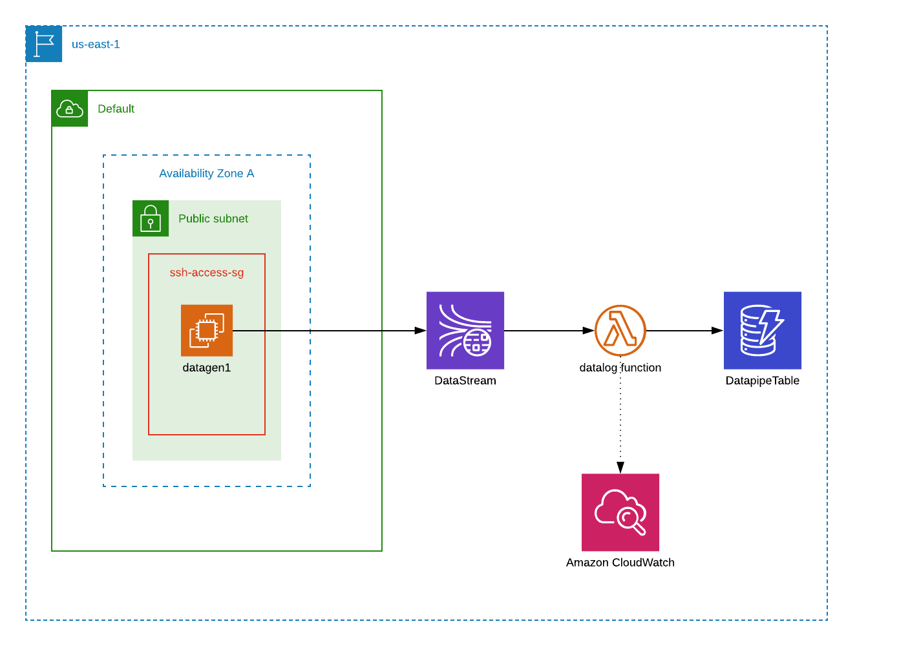

:doctype: article
:blank: pass:[ +]

:sectnums!:

= SEIS 615 Assignment 11: Serverless Pipeline Extended Edition 
Jason Baker <bake2352@stthomas.edu>
3.0, 11/19/2021

== Overview
Serverless applications represent the continued evolution of cloud-native application architecture. We can use serverless applications to build platforms that support millions of customers and process enormous amounts of data. In our class project this week, we deployed a basic data pipeline using a CloudFormation SAM template, Lambda function, and Kinesis stream. In this week's assignment, you will expand the functionality of the CloudFormation template by creating a Lambda function to store Kinesis messages in a DynamoDB table.

[NOTE]
====
You must understand how to write code in the Python programming language to successfully complete this assignment. The code required isn't advanced, but you will need to understand how to import modules, work with JSON, and use the boto3 library (AWS SDK). If you don't have much Python experience, I recommend using one of the many on-line training options to improve your skills. 
====

== Requirements

You need to have a personal AWS account and GitHub account for this assignment.

== The assignment

Let's start consuming those Kinesis messages!

=== Setup project environment

The assignment will use the same CloudFormation stack as our recent class project. Review the project again for details. You can continue to use the EC2 instance you created during the project or you can create a new one (remembering to save your work first). *If you skipped the class project, you will need to complete it before continuing work on this assignment.* Note, while the work from the class project is required to complete this assignment successfully, only the additional resources added in this assignment will be graded.

You should be able to shell into the EC2 instance and access the serverless application files. The `datapipe.yml` CloudFormation template should contain the two resources setup in the class project: a Lambda function and a Kinesis stream. 

Our goal in this assignment is to extend the existing serverless application to store Kinesis message data in a DynamoDB table.

=== Create DynamoDB table

Modify the CloudFormation SAM template to create a DynamoDB table with a logical name of `DatapipeTable`. The name of the physical table should be generated dynamically by CloudFormation. The table should have a primary key with the name `id`, which stores string values. It should use the pay-per-request billing model. Data stored in the table should use server-side encryption. 

I recommend using the CloudFormation SAM specification at https://github.com/awslabs/serverless-application-model/blob/master/versions/2016-10-31.md as a documentation resource when creating the DynamoDB table. 

=== Create Lambda function resource

You will need to create a second Lambda function which uses the Kinesis stream as an event source. Yes, it's possible to connect multiple Lambda functions to the same Kinesis stream to process messages in parallel. 

Create a Lambda function written in python3.6 with a logical name of `DatastoreFunction`. The function should be associated with a Python script file named `datastore.py`. The Lambda function will need to be able to write data to a DynamoDB table, so it should use `AWSLambdaBasicExecutionRole` and `AmazonDynamoDBFullAccess` as execution policies. This role is a more powerful than what we would normally use in practice, but it's okay for this assignment. In general you should be carefule using these types of AWS managed roles for your work projects.

The code you create in the Lambda function will need to know the name of the DynamoDB table. How do we provide that name to the function? A common way to inject parameters into Lambda functions is to use environment variables. Configure the Lambda function to use an environment variable called `TABLE_NAME` which references the name of the DynamoDB table.

=== Create Lambda function script

Writing the `datastore.py` Lambda function script is probably the most challenging part of the assignment. However, keep in mind that this function can be written in less than 20 lines of code. Don't overthink it.

The function will receive events from the Kinesis stream consisting of a list of message records. Each message is a binary JSON object. The Lambda function should put each message from the Kinesis stream into the DynamoDB table. Each item in the table should look
something like this:

       {
            "y": {
                "S": "3.5100361252370282"
            },
            "id": {
                "S": "1476-563"
            },
            "is_hot": {
                "S": "Y"
            },
            "x": {
                "S": "7.730065880848981"
            }
        }

Here are a couple hints:

* Review the `datalog.py` script to understand how to iterate over the records in the event object.

* boto3 is your friend. You will need to use the boto3 python module in order to write data to a DynamoDB client. Check out the documentation at: https://boto3.amazonaws.com/v1/documentation/api/latest/reference/services/dynamodb.html

* Remember that environment variable you setup earlier? The Lambda function can access environment variables using the `os` module and the `os.environ['VARIABLE_NAME']` method.

* The decoded Kinesis message payload uses a binary JSON format. DynamoDB is expecting the Lambda function to push in a dictionary object, so you will have to find a way to convert the message payload into a dictionary. 

* The `id` attribute in the stream message is used as the partition key value in the DynamoDB table.

* Try to avoid adding records to the DynamoDB table one-at-a-time. This sort of solution would likely not be acceptable in real-world applications because of the added expense and poor performance.

=== Test serverless application

Once you have written and deployed the `datastore.py` script as a Lambda function, you should run the `data_generator.py` Python3 script to test the new environment. The generator script will push 1000 messages into the Kinesis stream, and the stream events will trigger both Lambda functions in the CloudFormation stack. 

Take a look at the Lambda function metrics and logs for your new Lambda function. It's not uncommon to see an error message during your first test. Fix the error and deploy the changes back into your CloudFormation stack. Run the generation script again. You may have to iterate over this process several times to get the new Lambda function working properly. You can always delete the CloudFormation stack and redeploy if you need a fresh start.

You should be able to go to the DynamoDB web console and view a list of the items in the table after invoking the new Lambda function successfully. Do you see the records from the Kinesis stream stored in the table? If so, congratulations you're done! If not, keep working at it.

Perform a scan of the DynamoDB table and store the results in a file called `tablescan.json`:

    aws dynamodb scan --table-name datapipe > tablescan.json

Take a look at the JSON file created by the scan. You should see all of the data items stored in the database table.

=== Check your work

The assignment GitHub classroom link is: https://classroom.github.com/a/ECtvZfws

Here is what the contents of your git repository should look like before final submission:

====
&#x2523; datapipe.yml +
&#x2523; packaged-datapipe.yml +
&#x2523; tablescan.json +
&#x2517; /lambda +
&nbsp;&nbsp;&nbsp;&#x2523; data_generator.py +
&nbsp;&nbsp;&nbsp;&#x2523; datalog.py +
&nbsp;&nbsp;&nbsp;&#x2517; datastore.py +

====

=== Terminate application environment

The last step in the assignment is to terminate your CloudFormation stack and EC2 instance on AWS.

== Submitting your assignment
I will review your published work on GitHub after the homework due date.
