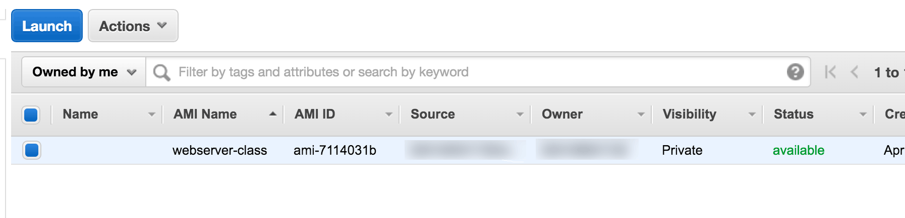

:doctype: article
:blank: pass:[ +]

:sectnums!:

= SEIS 615 Assignment 3: AWS
Jason Baker <bake2352@stthomas.edu>
2.0, 8/10/2020

== Overview
This week we will get some hands-on experience with EC2 and S3. You have been
using EC2 for a couple weeks now, but this assignment will dive deeper into
its capabilities.

One of the challenges of an assignment like this is that the AWS web console
changes all the time without warning. Therefore, the instructions can't be too
tightly coupled to the AWS web interface. In other words, instead of telling
you exactly which link to select or button to push on the AWS web console, you
will need to make reasonable decisions as you work through the assignment.

If you get stuck on a step, do a little research on the AWS documentation site or
reach out to the class on Slack. Your feedback will be incorporated into future
versions of the assignment.

== Requirements

You need to have a personal AWS account and GitHub account for this assignment.

== The assignment

One thing that's important to note about this assignment is that one of the output artifacts you will create is an AMI that will be used on the next assignment. In other words, you must complete this assignment in order to work on next week's assignment. Ready your engines. Let's rev up some instances!

=== Create a role

The first step in the assignment is to create a new role. We talked about
roles briefly in class. Basically, a role is a way to assign privileges to
a resource, such as an EC2 instance. A role lets you treat an instance kind
of like a user.

For example, you can create a role that allows access to data
stored on S3 and then assign this role to an EC2 instance. Applications running
on the EC2 instance can use the role to access S3 data without having to
store an access key and secret key on the application server somewhere. This represents a superior security configuration.

Let's create this S3 access role now.

  * Log into the AWS web console and select the *IAM* service.

  * Select the menu item to manage *Roles*.

  * Select the appropriate button or link to *create a new role*.

  * Give the role the name: *S3-full-access*

  * AWS supports several different types of roles. Your new role will be an
  *Amazon EC2* Service Role. Select the button or link corresponding to this role.

  * Each role type may have hundreds of policies associated with it. A policy is a
  configuration document which defines specific access privileges. You are looking
  for a policy called *AmazonS3FullAccess*. Usually you can filter the policy
  table listing by typing `s3` into a filter text input. Once you see the correct
  policy, check it and move on to the next step.

  * You should now be able to *create* the role.

If you created the new role properly, you should see the `S3-full-access` role listed
in the IAM roles table.

=== Create an S3 bucket

Next, let's create an S3 bucket in the us-east-1 region (Northern Virginia) to store some data. Go ahead and select the S3
service on the AWS console. If you haven't created an S3 bucket before you might
see some sort of welcome message explaining the purpose of the S3 service.

  * Once you see the S3 dashboard, click the button or link to *create a bucket*.

  * Name your new S3 bucket: `<AWS username>-assignment-3`, where <AWS username>
  is your personal Amazon username (not your e-mail address). Remember,
  S3 bucket names are universal which means that your bucket name has to be unique
  worldwide. On the off chance that your bucket name is already in use, just
  try a slightly different name.

.Example
----
jbaker-assignment-3
----

  * You should be able to select a button or link to *create* the bucket at this point.

=== Upload data to S3

You can upload files to S3 now that your new bucket is setup. Select your new bucket
on the S3 dashboard and look at its *properties*.

  * Select the *Tags* property and add a new tag with the key `Project` and the
  value `Assignment 3`. It's a good idea to tag resources you create on AWS. Tags
  can be any sort of key/value pair. Organizations use tags to track resources by
  tagging resources with an owner name, organizational unit, or budget ID.

  * Next, open a text editor on your local workstation and create a new text file
  called `index.html`. The file should contain the following text:

----
<!doctype html>

<html lang="en">
<head>
  <meta charset="utf-8">
  <title>Infrastructure Assignment 3</title>
</head>

<body>
  <h1>My 3rd Infrastructure Assignment</h1>
</body>
</html>
----

  * Select the appropriate button or link on the S3 console to *upload* a file
  to your new bucket. Either drag your `index.html` file into the browser window or
  click the link to *add* the file to the bucket.

You should now see the `index.html` file in the bucket file listing. Did
you notice that you can also create folders inside S3 buckets? Folders are a
useful way to organize your data within buckets.

=== Encrypt S3 data

You can easily encrypt data that's stored on S3. When you uploaded your file to
the S3 bucket, the data transfer occurred over an SSL/TLS-secured communications
channel. S3 encryption allows you to encrypt your data-at-rest. This prevents
someone from retrieving your data from the physical hard drive or SSD it's stored on.

  * Select your `index.html` file in the S3 console and look at its properties.
  To view the file's properties, you may need to select an *actions* button or
  link and then select a *properties* option.

  * Look at the file property *details*.

  * You should see a properties setting for *Server Side Encryption*. Set this
  property to *AES-256* and *save* the change.

AES-256 is the standard encryption algorithm used by Amazon to secure data in
many of its services.

=== Launch Linux server

The next step is to launch a Linux instance using EC2.
In previous assignments, you accepted all of the server launch defaults when launching a
Linux instance. This time you will customize some of the launch settings by
*configuring the instance details*. In particular,
you will associate the S3-full-access role you created previously with the new instance.

The server should have the following characteristics:

  * Amazon Linux 2 AMI 64-bit (usually the first option listed)
  * Located in Northern Virginia region (us-east-1)
  * t2.micro instance type
  * Auto-assign Public IP is enabled
  * IAM Role is set to `S3-full-access`
  * Root volume size set to 10 GiB
  * Create a tag with a key of `Name` and a value of `webserver1`
  * Create a new security group for the instance called `webservers-sg` with the following policies:
    ** SSH from anywhere 0.0.0.0/0
    ** HTTP from anywhere 0.0.0.0/0
    ** HTTPS from anywhere 0.0.0.0/0
  * Review your configuration settings and launch the new instance.

Your instance settings should look similar to the settings in the image below.
Your configuration may be slightly different based on the availability of a
newer Amazon Linux 2 AMI.

image:../images/assignment3/server-launch-1.png["600","600"]

Note that when you are launching the server, you can elect to use the same
key pair you used last week or you can create a new key pair for this
server. Either option is fine. From a practical standpoint, it might make
sense to reuse the same key pair each time so that you don't have to
keep track of which key pair you used to launch a particular server.

=== Log into server
The next step is to log into the Linux server using a terminal program with
secure shell (SSH) support. You will need to have the server key and the
public IP address before attempting to log into the server. Remember, it will
take a few minutes for the server to initialize before you can connect to it.

=== Update server software
Once you log into the server, perform an update on all the Linux packages. Refer back
to previous lessons if you can't recall the command to do this. Also, install
the Git client on the server.

Next, let's install the Nginx webserver on the new Linux instance. Nginx is a
fast and lightweight web server platform that is widely used by many of the
largest websites in the world. Type in:

  $ sudo amazon-linux-extras install nginx1.12 -y

You've installed Nginx, but the web service isn't actually running yet. You can
confirm this by checking the running processes on the system and searching for
the term `nginx`:

  $ ps ax | grep nginx | grep -v grep

Remember learning about the pipe operator (vertical bar)? In this command we are piping the output from the list processes command (ps) into a text search command (grep). Putting it all together, this command tells the system to list out all running process and look for one named nginx.

Go ahead and start up the Nginx webserver:

  $ sudo systemctl start nginx.service

Try to run the `ps` command sequence again to see if the webserver is running. Just
hit the up arrow twice to replay the command or type it in again. You should
see something like:

  14689 ?        Ss     0:00 nginx: master process /usr/sbin/nginx
  14691 ?        S      0:00 nginx: worker process

Now for the real test. Open up a web browser on your workstation and type in
the public ip address of your Linux instance as the URL. Do you see the
welcome page? If so, congratulations! You've built a web server -- the first of
many in this course.

Don't panic if the welcome page doesn't appear in your browser. Part of the _joy_
of working in IT is learning how to troubleshoot problems. Here are some things
you can check:

  * Is the nginx server running on your instance?
  * Did you type in the correct public IP address in the browser?
  * Is your instance associated with a security group that allows incoming
  port 80 (HTTP) requests from anywhere (0.0.0.0/0)?

Make sure you can successfully test the Nginx web server before continuing with
this assignment.

=== Configure web server

Nginx is installed on the Linux instance and is currently running. However, if you
reboot the instance Nginx will not automatically restart. Let's fix that:

  $ sudo systemctl enable nginx.service

The Nginx web document root is located in the `/usr/share/nginx/html` directory.
The web document root is the default location that the Nginx webserver will
use to serve files. Change to this directory now.

If you list the contents of this directory, you will notice several files. The
most important one is called `index.html`. The web server will send the `index.html`
file to a web browser when it receives a request from the browser that does not
specify a file name. In other words, it's the default file the web server will
send.

You're going to update the `index.html` file with the one you stored on
Amazon S3. But how are you going to copy the file from the S3 bucket onto your
instance? You will take care of that next.

=== Copy index.html from S3

Let's copy the `index.html` file from your S3 bucket into the web server
document root directory. Your instance already has access to the S3 bucket
because you created a role called `S3-full-access` and associated it with the
instance when you launched it earlier. The role assigned full S3 access
privileges to the instance.

AWS features may be accessed via the web-based console or an API. So far we've
just been using the web console when working with AWS. For example, you used
the web console to upload a file into your S3 bucket. However, everything you
can do via the web console can also be done via the API. That's the real
power of a platform like AWS. Everything is programmable and scriptable.

Amazon created a command line interface (CLI) that you can use to work with
AWS infrastructure. The CLI is automatically installed on Amazon Linux instances.
Try it out now by typing:

  $ aws help

Pretty cool, huh? You can do pretty much anything with this CLI. Let's use it
now:

  $ sudo aws s3 cp s3://<your S3 bucket name>/index.html /usr/share/nginx/html/index.html

.Example
----
$ sudo aws s3 cp s3://jbaker-assignment-3/index.html /usr/share/nginx/html/index.html
----

Go back to your web browser and reload the web page. You should see your
new page loaded.

The page isn't very fancy yet. Perhaps we'll expand on it future assignments.

=== Take a snapshot

Before we continue working on this assignment, let's take a snapshot of our new instance.
A snapshot can be used to backup the data on our instance or to create new
instances.

Go to the EC2 dashboard on the AWS web console. Select your instance and then
stop it by selecting the *Actions* button and choosing the instance state
*stop* option.

Stopping your instance before taking a snapshot is a recommended practice
because it allows the data on the server to _quiesce_. This basically means
that data is written to disk and the system data is no longer in a state of
flux.

Click on the *Volumes* menu item on the EC2 dashboard and select the volume
associated with your instance. Next, select the *Actions* button and the
*Create Snapshot* option. Name your new snapshot `webserver1-snapshot` and
feel free to give it a description.

It will take a few minutes to create a snapshot of your instance volume. The
process takes longer the first time because it has to completely backup
the current volume. If you take another snapshot of this volume in the future,
the snapshot will finish much faster because it only stores the data that
changed since the previous snapshot.

You can watch the progress of the snapshot by selecting the *Snapshots* menu
link in the EC2 dashboard.

=== Create an AMI

Once the snapshot is completed, you can use the snapshot to create a personal
Amazon Machine Image (AMI). Select the new snapshot in the *Snapshots* page
lising. Select the *Actions* button and the *Create Image* option.

Name your image `webserver-class` and give it a description of `class
server`. Set the virtualization type to `Hardware-assisted virtualization`.

Click on the *AMIs* menu link on the EC2 dashboard. You should see your new
AMI listed. Notice how the AMI has an owner (your AWS account ID) and the
visibility is private.

=== Instance meta-data

One of the challenges IT professionals face when working with cloud-based
infrastructure like EC2 instances is understanding how to programmatically
access information about the underlying infrastructure. For example, how does
one programmatically determine what security group an instance is in? It's
easy to look at the web console to answer this question. But if you need to
write a shell script that requires this information, the solution isn't
very clear.

Fortunately AWS provides an ingenious solution called *instance meta-data*.
Basically, AWS provides a virtual web server that any instance can access to
discover information about itself. Sounds kind of strange doesn't it? Try it
out:

  $ curl http://169.254.169.254/latest/meta-data/

You should receive a list of meta-data categories in the response. The `curl`
command is a simple text-based web browser. The curl browser accessed
a virtual website located at a special private ip address, `169.254.129.254`.
All of the meta-data associated with the instance can be accessed by
constructing appropriate URL paths. For example, if you want to retrieve the
instance type for the current instance, enter:

  $ curl http://169.254.169.254/latest/meta-data/instance-type

You should see `t2.micro` in the response. Understanding how to access
instance meta-data is important when programmatically working with
EC2 instances.

=== Create a couple scripts

Let's create a couple scripts for this week's assignment submission. The first script will automate many of the tasks you performed earlier in this assignment. Remember, automation is the key to producing reliable and repeatable results. The second script will take our new found knowledge of instance meta-data and put it to work.

Start by creating a directory in your home directory called `scripts`. Then change directory to the new `scripts` directory and initialize a new git repository.

Create the first shell script and name it `provision.sh`. A user can run the `provision.sh` script to automatically update the software packages on the instance, install Nginx, and copy files into the website document root directory. This script should support the following requirements:

* When executed without any arguments, the script will perform the following steps:
** Update all system packages
** Install the Nginx software package
** Configure nginx to automatically start at system boot up.
** Copy the website documents to the web document root directory.
** Start the Nginx service.
* If the user starts the script with a `-r` or `--remove` argument, the script will perform the following steps:
** Stop the Nginx service.
** Delete the files in the website document root directory (/usr/share/nginx/html).
** Uninstall the Nginx software package.
* If the user starts the script with a `-v` or `--version` argument, the script will return the value `1.0.0`
* If the user starts the script with a `-h` or `--help` argument, the script will provide useful help information.
* You should encapsulate all of the features of the script in functions.

The second script will retrieve some data from the Instance Metadata service. Inside the `scripts` directory you need to create a new shell script called `instancedata.sh`
which does the following:

* Creates a file called `metadata.txt` in the current directory
* Retrieves and stores the following meta-data in the `metadata.txt` file:
** The instance *hostname*.
** The *iam info* associated with the instance.
** The *security groups* associated with the instance.

The contents of the `metadata.txt` file should look similar to this after
  executing the script:

  ip-172-31-51-146.ec2.internal
  {
    "Code" : "Success",
    "LastUpdated" : "2016-04-05T16:45:21Z",
    "InstanceProfileArn" : "arn:aws:iam::234149541132:instance-profile/S3-full-access",
    "InstanceProfileId" : "AIPAIKSVFD6G6V26PMAGO"
  }
  webservers

Here are a couple hints for writing this script:

  * You can write this script in as little as 4 lines of code. You do not need to handle any input arguments or create a function.
  * Remember that you can take the output from a command like curl and redirect
  it into a file using the right angle-bracket character (`>`). If you want
  to append data to a file then use double brackets (`>>`).
  * Notice how the different pieces of meta-data in the `metadata.txt` file are
  written on separate lines. The `curl` command can automatically add a
  linefeed character to it's output by using a flag: `curl -w "\n" <url>`,
  where `<url>` is the website address being accessed.

=== Check your work
Here is what the contents of your git repository should look like before final submission:

====
&#x2523; provision.sh +
&#x2523; instancedata.sh +
&#x2517; metadata.txt +
====

Note, the shell script files should be executable.

=== Commit the work

Once your scripts are working properly, commit the files in the scripts directory to you local Git repository.

In the previous assignment, we created a new assignment repository on GitHub and then
pushed an existing local repository up to GitHub. We are going to follow the
same process in this assignment. Refer back to the previous assignment if you
need to recall the specific commands.

  * Create the assignment repository on GiHub Classroom: https://classroom.github.com/a/ITDThRDb
  * Modify the origin remote on your local Git repository to point to the
  address of this new GitHub repository, something like: https://github.com/ustseis615/assignment-3-aws-<username>.git

  * Push your local master branch up to the GitHub repository

Congratulations! Your work is now saved.

=== Terminate server

The last step in the assignment is to terminate your Linux instance and all other AWS resources (S3, security group, etc) you created in the assignment. AWS will bill you for every
hour the instance is running. The cost is nominal, but there's no need to rack
up unnecessary charges and we won't use this instance in the next lesson. Don't delete the AMI created during this assignment because you will need to use it again next week.

== Submitting your assignment
I will review your published work on GitHub after the homework due date.
