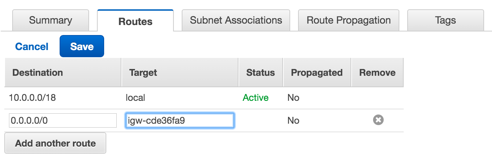

:doctype: article
:blank: pass:[ +]

:sectnums!:

= SEIS 665 Assignment 5: VPC
Jason Baker <bake2352@stthomas.edu>
1.1, 1/21/2017

== Overview
This week we will build a VPC from scratch and work with an elastic load
balancer to deploy a resilient website for our company, Next Gen Solutions.

Like the previous assignment, you may have to work through some of the detailed
steps to complete the requirements. If you get stuck on a step, do a little
research on the AWS documentation site or reach out to the class on Slack. Your
feedback will be incorporated into future versions of the assignment.

== Requirements

You need to have a personal AWS account and GitHub account for this assignment.

== The assignment

Get ready to build your virtual private cloud!

=== Create a Virtual Private Cloud and subnets

The first step in this assignment is to create a new Virtual Private Cloud (VPC).
Go to the AWS web console and access the VPC dashboard. Make sure you are using
the Northern Virginia (us-east) region. Select the *Your VPCs*
menu option and click the button or link to *create a VPC*. Your new VPC should
have the following parameters:

  * Name: nextgen-vpc
  * CIDR: 10.0.0.0/20
  * Tenancy: Default

Once, the VPC is created go ahead and create a couple subnets. The VPC will have
two subnets -- one public and one private. Select the *Subnets* menu item on the
VPC dashboard and click the button or link to *create a subnet*. You will have
to go through this process twice, once for each subnet.

The subnets should have the following parameters:

  * Subnet #1
    ** Name: nextgen-public
    ** VPC: nextgen-vpc
    ** AZ: us-east-1a
    ** CIDR: 10.0.1.0/24

  * Subnet #2
    ** Name: nextgen-private
    ** VPC: nextgen-vpc
    ** AZ: us-east-1b
    ** CIDR: 10.0.2.0/24

Note, if the us-east-1a or us-east-1b availability zones are not currently
listed, you may select any other availability zone in the region. The two
subnets just have to be located in different AZs.

=== Create an Internet Gateway

The next step is to create an Internet Gateway for the new VPC. The Internet
Gateway will allow instances with a public IP address to communicate with
devices on the Internet.

Go to the *Internet Gateways* menu on the VPC dashboard and click the
*create Internet Gateway* button or link. Name your Internet gateway:
`nextgen-ig`.

Once the Internet Gateway is created, you will need to attach it to your
new VPC by selecting the gateway and clicking the *attach to VPC* button.

=== Setting up routing

Let's recap what you have done to this point. You created a new VPC and setup
two subnets within the VPC. You also created an Internet Gateway and attached
it to the VPC. The VPC has a main route table that was setup for you when
you created the VPC. The route table has a single route that basically says
"route traffic from any instance in any subnet to any other instance".

If you launched an instance with a public IP address into the public subnet
in your new VPC, would it be able to communicate with the Internet? No. The
reason is because there is no network route setup to route data from the
public network to the Internet Gateway.

Some of this network routing stuff may sound a little confusing, especially
if you don't have any data networking experience. Think of it like plumbing.
We've installed the bathtub and the sinks, but we haven't laid out the pipes
yet. Let's work on that now.

Click on the *Route Tables* link on the VPC dashboard. Notice that a route table
already exists for your new VPC. This is the main route table for the VPC and
all subnets not explicitly associated with another subnet use this route
table. Read that last sentence twice, because the concept is a little confusing.

Go ahead and *create a route table* by clicking on the appropriate button. Name
this route table: `nextgen-public-routes`. Make sure to designate the
proper VPC when creating the route table.

Select the new route table and look at its route listing. You will notice a single
route with the network 10.0.0.0/20 and target of `local`. This route will
route traffic from any subnet in the VPC to any other subnet. That configuration
is fine, however we need to add a route to send all traffic to Internet destinations
through the Internet Gateway.

Edit the route table for the new subnet and add a new route to the destination
`0.0.0.0/0` (which is a catch-all network) and a target of the Internet Gateway
identifier. Make sure you save the updated route table when you are done.

Your new route table isn't associated with any subnets so it isn't actually doing
anything yet. Click on the *subnet associations* for the new route table and edit
the current properties by adding the `nextgen-public` subnet to the
routing table. Save your work.

Now if you launch an instance into the VPC's public subnet it should be able to
communicate with the Internet. Let's test that assumption next.

=== Launch a server

We launched an instance based on the Amazon Linux AMI in previous
assignments and then we modified the Linux instance by installing whatever
software we needed. However, in the previous assignment we built out a Linux
server and created an AMI. Now we can use that AMI to launch a new instance,
saving us the time and effort required to get a new webserver up and running.

Go to the EC2 dashboard in the AWS web console and launch a new instance. The
instance should have the following properties:

  * Use the private AMI you created from the previous lesson (look in the *My AMIs* panel
    during the AMI selection)
  * Located in Northern Virginia (us-east)
  * t2.micro instance type
  * Network is `nextgen-vpc`
  * Subnet is `nextgen-public`
  * Auto-assign Public IP is enabled
  * Root volume size set to 10 GiB
  * Create a tag with a key of `Name` and a value of `webserver1`
  * Create a new security group for the instance called `webservers` with the following policies:
    ** SSH from anywhere 0.0.0.0/0
    ** HTTP from anywhere 0.0.0.0/0
    ** HTTPS from anywhere 0.0.0.0/0
  * Review your configuration settings and launch the new instance.

While this new instance is launching, let's launch another instance in the new VPC's
private subnet. The second instance should have the following properties:

* Use the private AMI you created from the previous lesson (look in the *My AMIs* panel
  during the AMI selection)
* Located in Northern Virginia (us-east)
* t2.micro instance type
* Network is `nextgen-vpc`
* Subnet is `nextgen-private`
* Auto-assign Public IP is disabled
* Root volume size set to 10 GiB
* Create a tag with a key of `Name` and a value of `backend1`
* Create a new security group for the instance called `backends` with the following policies:
  ** SSH from sg-<webservers ID>  (where webservers ID is your webservers security group identifier, example: sg-f0321d88)
  ** HTTP from sg-<webservers ID>
  ** HTTPS from sg-<webservers ID>
* Review your configuration settings and launch the new instance.

The rules you created for the `backends` security group restrict incoming ssh, http,
and https requests to only those instances located in the `webservers` security group.
You can see how it's possible to use security groups to identify source networks
when creating rules in other security groups. This is a helpful abstraction because
you don't have to think about the actual networks that instances live in. You
can just focus on the security groups that instances belong to.

=== Connect to the public webserver

Your public webserver instance should be up and running at this point. Open up
a web browser on your desktop and try to connect to the public IP address of
this webserver. What do you see? You should see the website you created during
the previous assignment. Congratulations!

If you don't see this page then you
have some troubleshooting to do. Walk through the subnet setup and route table
configuration steps to verify your work. Did you launch `webserver1` into the
public network on your VPC? Look at your resource configuration carefully and
methodically. You should be able to find the configuration error.

=== Connect to the private web server

You were able to connect to the first web server but what about the second
web server you launched in the private network? Well, it isn't accessible for
two reasons. First, the second instance doesn't have a public IP address. Verify
that by looking at the instance properties on the EC2 dashboard. Second, the
instance is hosted within a subnet that doesn't have a route connected to
an Internet Gateway.

The `backend1` instance may not be accessible from the Internet, but you
should be able to access it from `webserver1`. Test that out by opening a
terminal connection to `webserver1`. Once you have logged into `webserver1`,
try to connect to the website hosted on `backend1`:

  $ curl <backend1 private IP address>

.Example
----
$ curl 10.0.2.241
----

You should see the text from your web site displayed in the terminal output. The
security group configuration allows `webserver1` to communicate with `backend1`
via http.

Now let's try to ssh into the `backend1` instance. In order to do that you will
need to copy your private ssh key from your local workstation onto the `webserver1`
instance.

You should still be connected to `webserver1` via your terminal program. Open
up the ssh key pair on your local workstation in a text editing program and
copy the contents of the file into your clipboard.

Next, create a file called `server-key.pem` in the `~/.ssh` directory using a text editor on `webserver1` (nano or vim) and paste the contents of your clipboard into this file. Make
sure you save the file.

You could also copy the key file from your local workstation to the cloud instance using the Secure Copy command (`scp`). This is something you can try to figure out on your own if you are interested.

Now, open a terminal connection from `webserver1` to `backend1`:

  $ ssh -i ~/.ssh/server-key ec2-user@<backend1 private IP address>

.Example
----
$ ssh -i ~/.ssh/server-key ec2-user@10.0.2.241
----

You probably received a security error after trying this connection request.
The access permisions on the `server-key.pem` file you create are too insecure.
Let's fix that:

  $ chmod 600 server-key.pem

Hit the up arrow key a few times to replay the `ssh` command. You should
successfully connect to the `backend1` instance. Congratulations, you just
used `webserver1` as a bastion host!

In a real production environment, the bastion host access, security groups,
and network access control lists would be more carefully locked down than in
this assignment. You would probably never use a web server as a bastion host.
The key is understanding conceptually what a bastion host is
and how it fits in the overall network architecture.

=== Update the backend server

We should make sure that our backend server has all the latest software updates.
Go ahead and issue the `yum` command to update the server.

Whoa, what's up with the connection timeout errors? Think about the VPC subnet
configuration and where the `backend1` server lives. The private subnet does
not have a route to the Internet Gateway.

Maybe we should setup this Internet Gateway route on the private subnet.
Then we would have to assign a public IP address to the `backend1` instance (an
elastic IP address in this case). However, now the `backend1` instance would
be potentially accessible via the Internet. That defeats the whole purpose of
creating a private subnet.

We need a way to allow the `backend1` instance, using a private IP address, to
communicate with hosts on the Internet so that it can download software updates.
Sounds like a NAT is what you need!

=== Deploy a NAT

We will deploy a NAT to allow the `backend1` instance to communicate with the
Internet. The NAT instance needs to live in the public subnet because that
subnet has access to the Internet via the Internet Gateway.

Go to the VPC dashboard in the AWS web console. Select the *Elastic IPs* menu
link. You need to allocate an elastic IP address because the NAT requires a
public IP. Click on the button to *allocate a new address*.

Next, select the *NAT Gateways* menu link on the VPC dashboard and click the
button to *create a NAT gateway*. Select the public subnet you created for your
VPN and the elastic IP address you created in the previous step.

It takes a few minutes for the NAT Gateway to initialize. You can view the current
status of the gateway in the NAT Gateway listing on the VPC dashboard. The
gateway is simply a specialized EC2 instance managed by AWS. In fact, you can
easily launch a NAT instance on your own using an AMI. We're just taking a bit
of a short cut following this particular process.

While the gateway is initializing, let's modify the route table for the private
subnet so that private instances can route Internet-bound traffic through the
NAT Gateway.

Click on the *Route Tables* link in the VPC dashboard and select the route table
associated with the private subnet. Which route table is that? Recall that a
default route table was setup when you initially created your VPC. This route
table is also known as the *main* route table for the VPC. Any subnet that's
not explicitly associated with a route table uses the main route table by default.

In this case, select the route table designated as the main route table for
your VPC. Edit the routes associated with this table and add the following route:

  Destination: 0.0.0.0/0
  Target: nat-<nat ID>

.Example
----
0.0.0.0/0 nat-0354b30716cdaefa4
----

Save your edits to the route table.

Okay, ready for the big test? <drumroll please> Go back to your terminal program.
You should still be connected to the `backend1` instance. Confirm that by typing
in:

  $ uname -a

You should see a 10.0.2.x IP address displayed in the command output. If not,
you need to log into the `backend1` server again using your bastion host
(`webserver1`).

Go ahead and try to update the software again on `backend1` using the `yum`
command. Viola! The package manager should begin updating the system. The
`backend1` instance is now communicating to hosts on the Internet using the
NAT Gateway. Note that this communication can only be initiated in one
direction. There is no way an Internet device can initiate a connection to
the `backend1` server through the NAT Gateway.

=== Create a Git repo

While you are on the `backend1` server, create a directory called `assignment-5-vpc-<username>` (where <username> is your GitHub account name). Change to this directory and initialize a Git
repository. Because you are creating a Git repository on a private network, Git
might complain about your identity when you try to commit files. You can set
your local Git identity by running these commands:

  $ git config --global user.email "your@email.com"
  $ git config --global user.name "your GitHub username"

When you create a Git repository and start working with files, the master branch of the repository is checked out by default. We generally try to avoid working directly on the master branch in the real world. Go ahead and create a new branch called `develop` and check it out.

=== Create a shell script

The next step is to create a shell script called `metadata.sh` inside the assignment directory. The shell script should meet the following requirements:

* If the user runs the script with the `-c` or `--create` arguments, the script will perform the following operations:
** Create a file called `backend1-identity.json` in the present working directory containing
the data returned by accessing the URL:

  http://169.254.169.254/latest/dynamic/instance-identity/document/

** Create a file called `backend1-message.txt` in the present working directory containing the data returned by accessing the following URL. Note, you will need to pass the `-vs` flag (verbose/silent) to the `curl` command to output this data properly. Also, you will need to redirect the output
in a special way based on the way the `curl` command works (using the `tee` command).

  https://s3.amazonaws.com/seis665/message.json

    Example:
    $ curl -vs https://s3.amazonaws.com/seis665/message.json 2>&1 | tee backend1-message.txt

** Copy the file `/var/log/nginx/access.log` into the present working directory.

* If the user starts the script with a `-v` or `--version` argument, the script will return the value `0.5.0`

* If the user starts the script with a `-h` or `--help` argument, the script will provide useful help information.

* If the user doesn't provide any arguments the script will provide basic usage information.

* You should encapsulate all of the features of the script in functions.

Once you have completed the shell script, make sure you run the script properly to create the two required files. Commit all the files in the assignment directory to the repository. Next, you will need to push your local
repository up to GitHub:

* Create a new repository on GiHub Classroom by clicking this link: https://classroom.github.com/assignment-invitations/a76427f483ecfc98a401a1fef07473d4
* Merge your `develop` branch into the `master` branch on your local Git repository.
* Push your local master branch up to the GitHub repository.

Confirm that the four files are now in your new GitHub repository:

* metadata.sh
* backend1-identity.json
* backend1-message.txt
* access.log

=== Remove NAT and backend server

Now that you have successfully established this NAT connection, we are going
to remove it. The NAT Gateway is no longer needed in this exercise. Go back
to the VPC dashboard on the AWS web console and click the *NAT Gateway* menu
link. Select your NAT Gateway and click on the appropriate button to
*delete the NAT Gateway*.

We should also deallocate the elastic IP address we created because we will
get charged for it even if we don't use it. Click on the *Elastic IP* link
on the VPC dashboard. Select the elastic IP you created earlier and click on
the action to *deallocate the address*.

Finally, we no longer need to use the `backend1` instance in this lesson, so
go to the EC2 dashboard and terminate this instance. Leave the `webserver1`
instance running though because we will continue to use that instance.

=== Launch another web server

During the last part of the assignment you will launch a second web server and
setup a load balancer to distribute traffic between the two servers. We could
launch another web server into the same subnet as the existing web server.
However, that wouldn't take advantage of the multiple availability zones located
in the us-east region. Preferably, we would like to launch the second web server
into a different availability zone so that if the data center supporting an
 availability zone fails, the load balancer will redirect all traffic to
the web server in the other availability zone.

Go to the VPC dashboard and create a third subnet in your VPC:

* Subnet #3
  ** Name: nextgen-public-2
  ** VPC: nextgen-vpc
  ** AZ: us-east-1c
  ** CIDR: 10.0.3.0/24

Modify the appropriate routing table so that instances within this new subnet
can communicate with the Internet (hint: look at subnet associations).

Go back to the EC2 dashboard and launch a new web server named `webserver2`. The new server should
have the same characteristics as the first web server with the exception that
it should be launched into the new `nextgen-public-2` subnet. This way
each web server is located in a separate subnet.

Can the two web servers communicate with one another? Let's think about that
question. Each web server is in a separate subnet, but the subnets use a routing
table that routes traffic between any instance in the same VPC. Both web servers
are in the same VPC. Also, both web servers share the same security group.
Therefore, yes the two web servers can communicate.

Before you launch a load balancer, open a terminal connection to `webserver1`.
Change to the directory `/usr/share/nginx/html/` and edit the existing `index.html`
file so that it looks like the following:

----
<!doctype html>

<html lang="en">
<head>
  <meta charset="utf-8">
  <title>Next Gen Solutions</title>
</head>

<body>
  <h1>Next Gen Solutions</h1>
  Webserver 1!
</body>
</html>
----

Make sure you save the file when you are finished editing it. Open a terminal connection to `webserver2` and modify the index.html file using the same code above, except enter "Webserver 2!" in the body of the html file.

The
websites hosted on `webserver1` and `webserver2` are now slightly different so
that you can visually see which server is providing the content to your web
browser. Let's launch a load balancer next.

=== Launch an Elastic Load Balancer

Select the *Load Balancers* link on the EC2 dashboard and click the button to
*create a classic load balancer*. The load balancer will have the following properties:

  * Name: `nextgen-lb`
  * Create it inside your VPC
  * Select the two public subnets
  * Assign the existing `webservers` security group
  * The load balancer should only have an http listener (port 80) configured.
  * Health Check
    ** Normally you probably wouldn't use `/index.html` as the health check path
    for a load balancer. You would create a separate health check web page.
    However, for this assignment just leave the path as the default.
    ** Set the Health Check Interval to 10 seconds
  * Add the `webserver1` and `webserver2` instances to the load balancer
  * Create a tag:
    ** Key: `Project`
    ** Value: `Assignment 5`

After you click the *create* button, click the *Load Balancers* menu link
on the EC2 dashboard. Then select the load balancer you just launched and
look at the set of *instances* associated with the load balancer. You will
notice that the status of the instances is _OutOfService_. This status means
that the web servers haven't passed the load balancer's health check yet.

image:../images/assignment5/loadbalancer-instances.png["600","600"]

Refresh the browser display after a minute or two and you should see the
status of the web server instances change to _InService_.

Once both instances are in service, click on the *Description* panel of the
selected load balancer to see its *DNS Name*. This name is the end point for
the load balanced service. You could open up a browser on your desktop and
type in the public IP address for either one of the web servers to see the
website. However, what you really want to do is use the address of the
load balancer.

The load balancer doesn't use a public IP address -- at least not one that's
visible to you. The load balancer's public IP address will change depending
on the status of the instances associated with it.

Open up a web browser on your desktop and type in the load balancer's DNS Name
as the URL.

.Example
----
nextgen-lb-1175121939.us-east-1.elb.amazonaws.com
----

You should see the website you created in the previous assignment. Hit the
refresh button on your browser a few times. Do you notice the web page content
changes depending on which web server is handling the request? The load
balancer is redirecting the request to the least utilized server.

=== Simulate a failure

Now you are going to simulate a service failure by stopping one of the
web servers. In the real world a server could fail for a number of reasons -
software bug, human error, or even a complete data center failure.

Let's say
that one of Amazon's data centers experiences a complete power outage and
takes down the `nextgen-public-2` subnet. Go to the EC2 dashboard,
select the `webserver2` instance and stop it.

Next, go back to the *Load Balancers*
listing and select your load balancer. Take a look at the state of the instances
connected to the load balancer. You should notice that `webserver2` is in an
out of service state. Wait 30 seconds and refresh the page if it hasn't changed
to this status yet.

The `webserver2` instance failed the load balancer health check and was taken
out of service. The load balancer will direct all future website requests to
`webserver1`. Go back to the web browser on your desktop and refresh the page
a few times. Notice how the webpage content stays the same.

Congratulations! You just deployed a highly resilient website and simulated a
partial service failure. Load balancers aren't just used for increasing
service resiliency, they can also increase performance by spreading website
requests across a group of web servers.

=== Save your work

Let's commit some more data to the Git repository you created earlier in the
assignment. Open a terminal connection to the `webserver1` instance (you might
  still have a terminal connection to this instance open).

Change to your home directory and clone the git repository you created earlier:

  $ git clone https://github.com/seis665/assignment-5-vpc-<username>.git

.Example
----
https://github.com/seis665/assignment-5-vpc-jasondbaker.git
----

If you recall, the Git clone operation makes a copy of the public GitHub repository in
your current directory. Next, change to the `assignment-5-vpc-<username>` directory.

Copy the `/var/log/nginx/access.log` file on the server to a new file named `access2.log` in
the current directory.

It's likely that you will need to set the Git identity settings before committing.
Enter these commands, substituting the values as necessary:

  $ git config --global user.email "your@email.com"
  $ git config --global user.name "your GitHub username"

Create a new `develop` Git branch and check it out. Now add the `access2.log` file to the repository and commit your changes. Merge the `develop` branch into the `master` branch. Push the master branch back up to GitHub. Verify that the new `access2.log` file exists on
your GitHub repository.

=== Check your work
Here is what the contents of your git repository should look like before final submission:

====
&#x2523; access.log +
&#x2523; access2.log +
&#x2523; backend1-identity.json +
&#x2523; backend1-message.txt +
&#x2517; metadata.sh
====

Note, the shell script file should be executable.

=== Terminate server

The last step in the assignment is to terminate the EC2 instances, delete
the load balancer, and delete the VPC. I'll leave this as an exercise for you to
figure out how to complete. Remember, you will get billed for each hour the EC2 instances and ELB are running (or at least consume your credits).

== Submitting your assignment
I will review your published work on GitHub after the homework due date.
