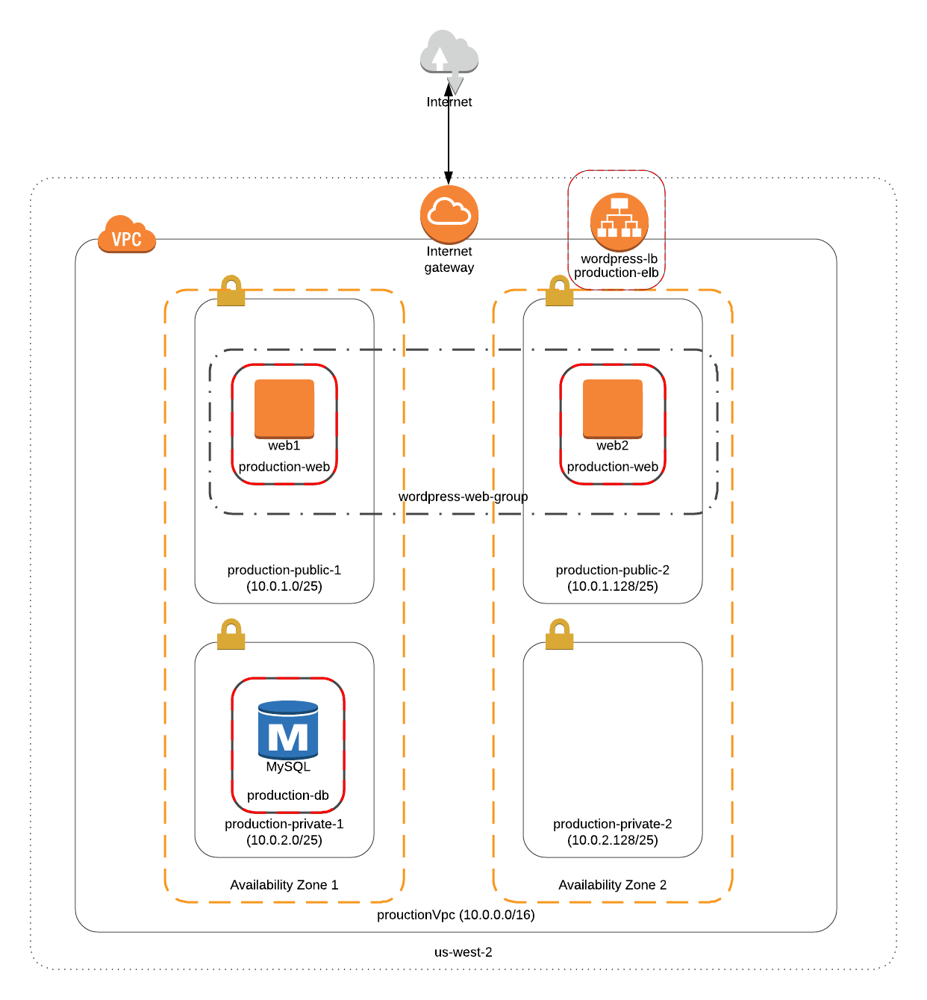

:doctype: article
:blank: pass:[ +]

:sectnums!:

= SEIS 665 Assignment 6: Autoscaling
Jason Baker <bake2352@stthomas.edu>
1.0, 4/8/2016

== Overview
This week we will enable auto scaling for a WordPress web application. The web
application will communicate with a backend database server running on RDS.

Like the previous assignment, you will have to work through some of the detailed
steps to complete the requirements. If you get stuck on a step, do a little
research on the AWS documentation site or reach out to the class on Slack.

== Requirements

You need to have a personal AWS account and GitHub account for this assignment.

== The assignment

Let's start scaling.

=== Create VPC and subnets

Each assignment in this course has been less prescriptive than the previous
and this assignment is no different. By now, you should understand how to configure
a VPC, subnets, routing tables, an internet gateway, an elastic load balancer, and
EC2 instances. You will create all of these components and more in this week's
assignment. Remember, you can always look back at previous assignments, class
recordings, or online AWS documentation if you get stuck on a step.

You will build a VPC and set of AWS services which conforms to the service
diagram below.

Start the assignment by creating a VPC named `productionVpc` in the `us-west-2 (Oregon)`
region with a CIDR block of `10.0.0.0/16`. Note, we're using a different region than
previous assignments! The VPC needs to have four subnets, each set of public and private subnets are located 
in *separate* availability zones (your choice):

* The `production-public-1` subnet
will use the `10.0.1.0/25` network.
* The `production-public-2` subnet
will use the `10.0.1.128/25` network.
* The `production-private-1` subnet
will use the `10.0.2.0/25` network.
* The `production-private-2` subnet
will use the `10.0.2.128/25` network.

All instances on the two production subnets will need to be able to communicate with
the Internet. You will need to configure the subnets and routing tables in the VPC to
allow this communication. How do you do this? You should be able to use the
knowledge you gained from previous assignments to figure this out.

=== Create Security Groups

While you are in the VPC dashboard, go ahead and create a couple security
groups. You will need to use these security groups when launching services
later in the assignment. It's always a good idea to plan out the security
requirements for your services in advance.

Create a security group called `production-elb`. This security group will
accept traffic from the Internet and distribute it to web servers. The
requirements for the security group include:

  * production-elb
    ** Name tag: production-elb
    ** Description: production load balancer
    ** VPC: productionVPC
    ** Inbound:
      *** HTTP allowed from the Internet

Create two security groups called `production-web` and `production-db`. The
first security group will allow all external devices to communicate with
the web server instances via SSH and HTTP. Here are the requirements for the
first security group:

  * production-web
    ** Name tag: production-web
    ** Group name: production-web
    ** Description: production web servers
    ** VPC: productionVPC
    ** Inbound:
      *** SSH allowed from your workstation
      *** HTTP allowed from the Internet

The second security group will allow only the web servers to communicate with
the MySQL database instance using port 3306. Here are the requirements for the
second security group:

  * production-db
    ** Name tag: production-db
    ** Group name: production-db
    ** Description: production database servers
    ** VPC: productionVPC
    ** Inbound:
      *** MySQL (3306) allowed from the web servers

=== Create RDS database

Wordpress is a very popular Content Management System (CMS) and like most CMS
systems it requires a database to persist content and user account information.
We will use a MySQL database managed by the RDS service to support this
database requirement.

Go to the RDS dashboard on AWS and launch a new MySQL database instance. The
launch wizard may ask you if you plan to use the instance for production (multi-instance) or
development purposes. In this case, select the development option (single-instance). In a real
production scenario you would want to use a database tier that supports
multi-AZ deployments. A single lower-cost database instance is fine for this
assignment.

The MySQL instance should have the following properties:

  * DB Engine Version = ~5.6 (most any recent release should work)
  * DB Class = db.t2.micro
  * Multi-AZ deployment: No
  * Allocated Storage: 20GB
  * DB Instance Identifier: wordpressdb
  * Master Username: wpdbadmin
  * Master Password: (choose a suitable password)
  * VPC: productionVPC
  * Subnet Group: Create a new DB Subnet Group which is associated with the two private subnets.
  * Publicly Accessible: No
  * Availability Zone: No Preference
  * VPC Security Group: production-db
  * Database Name: wordpress

The MySQL database instance will take several minutes to launch. Once the
instance is available, take a look at the instance properties and copy or
write down the database endpoint address. The address will look something
like this:

   wordpressdb.c4mwrq8d4std.us-east-1.rds.amazonaws.com

You will need to know this database endpoint address when setting up the WordPress web
application. Note that RDS will create the instance in one of the two private subnets. 
It doesn't matter which private subnet is used. 

=== Create an application load balancer

The auto scaling group will deploy multiple WordPress servers into your VPC.
You will need an application load balancer to distribute requests to the web servers
to ensure that the service is highly available.

Go to the EC2 dashboard and select the `Load Balancers` menu item. Create a
new application load balancer called `wordpress-lb` that will distribute HTTP (port 80) requests across
web servers located in both us-west subnets. The load
balancer should use `/wordpress/readme.html` as the health check ping path. You won't
be able to associate any EC2 instances with the load balancer yet. That's not
a problem since you can associate an instance with the load balancer later.

Note, make sure you select the correct VPC, subnets, and security group
settings for the load balancer. Review previous assignments if you are unsure
how to set these properties. Also, don't forget to tag the load balancer.

Create a load balancer target group called `production-webservers`. Remember to associate the
proper subnets with this target group. The target group will remain empty for now.

=== Create WordPress instance and AMI

The next step is to create a custom AMI containing a basic WordPress installation.
You will connect this installation to your MySQL database, and then store the
completed configuration as an AMI. You can use the new AMI to create an auto scaling
launch configuration.

Launch an EC2 instance with the following properties:

  * Amazon Linux AMI 64-bit
  * t2.micro
  * Network: productionVpc
  * Subnet: production-public-1
  * Auto-assign public IP: Enable
  * User data (in Advanced section):

  #!/bin/bash
  yum update -y
  yum install -y git httpd24 php56 php56-mysqlnd
  service httpd start
  chkconfig httpd on

  * Tag: Name = wordpress1
  * Security group: production-web

Note, if this is the first time you are launching instances in the us-west region, AWS
will likely prompt you to create a new set of SSH access keys. You should give this
keypair a different name than your other keypair. Also, if you are running Putty on
Windows you will need to use the Puttygen tool to create a private key that you can
import into Putty (see Assignment 2 video if you forgot how to do this step).

Once the instance is running, open a web browser on your desktop and browse
to the public IP address of the new instance. You should see a test page
appear in your browser. The user data script automatically updated the server
and installed a number of basic components needed by Wordpress, including
the Apache web server, PHP, and a MySQL library.

Connect to the new instance using an ssh terminal program. Create a new directory
in your home directory called `wpinstall` and create a git repository inside this
new directory.

=== Using the sed command

While you are working inside the `wpinstall` directory, create a new file called
`database.conf`. Add the following text content to this file:

  dbserver = database_name_here

One of the most common tasks we need to perform when automating the installation
of new services on systems is to modify service configuration files. We could
open configuration files using a text editor and manually make changes to the service
settings, but that isn't a very repeatable or scalable process. Let's look at a
programmatic way to update configuration files.

You can treat the `database.conf` file like a template which contains a key (dbserver)
and a value placeholder (database_name_here). What we need is a way to open the
file, find the placeholder value, and replace the placeholder with a new value.
We can do that using a nifty Linux program called `sed` -- the stream editor.

The `sed` command syntax we are going to use looks like:

  sed 's/value1/value2/' file

The `s` character means that you want `sed` to perform a value substitution. You provide two different values delimited by forward-slash (`/`) characters. The `sed` command will substitute any text matching `value1` for `value2` in the specified `file`.

Let's try it out. Type in the following command:

  $ sed 's/database_name_here/mydb.domain/' database.conf

You should see the stream editor output the text:

  dbserver = mydb.domain

The sed command opened the file, searched for the text "database_name_here" and
replaced it with "mydb.domain". Take a quick look at the contents of the
`database.conf` file. Hmm, that's strange. The contents of the file haven't
actually changed. That's because by default sed just makes the changes we
specified in a memory buffer. It doesn't write the updated file to disk unless
we pass in the `-i` flag. Let's try to run this command again:

  $ sed 's/database_name_here/mydb.domain/' -i database.conf

Now take a look at the contents of the `database.conf` file. That's better!

Now open up the `database.conf` file again in an editor and add a second line of text:

  define('WEBSITE_URL', 'your_website');

Let's try to use the `sed` command again to replace the value `your_website` with an actual website URL address. Try this:

  sed 's/your_website/http://www.google.com/' -i database.conf

Uh, oh. You probably received an error saying something like `bad flag in substitute command: '/'`. You received this error because the `sed` command is trying to replace one value (`your_website`) with another value. The problem is that the other value contains a couple forward-slash (`/`) characters. The `sed` command uses the forward-slash character as a delimiter between the two values. The forward-slash characters in the substitution value (`http://www.google.com`) are confusing the `sed` command. The way to deal with this issue is to use a backward-slash as an escape character to tell the `sed` command that the forward-slash characters are really part of the substitution value. Let's try the command again:

  sed 's/your_website/http:\/\/www.google.com/' -i database.conf

The special escape characters make the `sed` command string look a little strange, but it works!

=== Create install script

Let's start building a script to automate the installation of wordpress software
on the instance. Create a new shell script called `wordpress_install`. The
script should perform all of the following tasks in the order below:

{blank}

*Step 1)* Download the latest Wordpress software to the instance using the `wget` command:

  wget -O /var/www/html/wp.tar.gz https://wordpress.org/latest.tar.gz

The `wget` command is similar to the `curl` command we have used in previous
assignments. You can use the `wget` command to retrieve and download
data from a website, whereas `curl` may be used to upload data as well.

{blank}

*Step 2)* Now that the script has downloaded the latest version of the Wordpress software, it should unpack the software archive into the `/var/www/html/` directory using the `tar` command:

  tar xf /var/www/html/wp.tar.gz -C /var/www/html/

A tar archive is kind of like the Linux version of a zip archive on a Windows system. The `x` argument tells the `tar` command that it needs to extract files from the tar archive.

{blank}

*Step 3)* Remove the downloaded archive package (`wp.tar.gz`) from the /var/www/html directory.

{blank}

*Step 4)* The `tar` command extracted the contents of the software archive package into a new directory
called `wordpress` within the `/var/www/html/` directory. Technically the Wordpress web application is installed in the website document root at this point. However, you need to configure the Wordpress software to communicate with your database instance before accessing the Wordpress site on the web server.

Wordpress, like many software applications,
is configured using a text file containing various application configuration settings. The Wordpress software files include
a sample configuration file called `wp-config-sample.php`. Your script should copy this sample configuration file to another file in the same directory called `wp-config.php`.

{blank}

*Step 5)* Next, your script needs to modify the value of several configuration settings in the `wp-config.php` file. You learned how to use the `sed` command to update configuration values in the `database.conf` file earlier in this assignment. You should use the same technique here. Your script needs to configure the MySQL database access information in the `wp-config.php` configuration file by modifying values in six specific places:

a) Modify the following line in the `wp-config.php` file to replace `database_name_here` with the value `wordpress`:

  define('DB_NAME', 'database_name_here');

[WARNING]
*Do not copy this code into your script file!* This is not shell script code. It is PHP code that lives in the `wp-config.php` file. You need to write shell script code which substitutes the `database_name_here` placeholder value in the `wp-config.php` file with the value `wordpress`.

b) Modify the following line to replace `username_here` with the `wpdbadmin` username:

  define('DB_USER', 'username_here');

c) Modify the following line in the `wp-config.php` file to replace `password_here` with the admin password value you entered when creating the Mysql database:

  define('DB_PASSWORD', 'password_here');

d) Modify the following line in the `wp-config.php` file to replace `localhost` with your MySQL RDS instance endpoint address:

  define('DB_HOST', 'localhost');

[WARNING]
====
Note, in a production WordPress configuration you would never use
the administrator username and password for your MySQL database. Instead you
would create a database access account specifically for the WordPress
application. In this case, we're just using the administrative account as
a shortcut. Don't rely on this as a best practice!
====

{blank}

*Step 6)* Next, your script needs to make a change to the Apache web server configuration to improve
the security of the Wordpress application. The change will allow `.htaccess`
files to work properly. The proper `sed` command required in your script to make this change is a little tricky, so it is provided for you below:

  sed '/Directory \"\/var\/www\/html/,/AllowOverride None/s/AllowOverride None/AllowOverride All/' -i /etc/httpd/conf/httpd.conf

{blank}

*Step 7)* The script will also need to make some changes to the file access permissions on the
Wordpress directory because the application needs to be able to update local
files. The script should execute the following set of commands:

  groupadd www
  usermod -a -G www apache
  chown -R apache:www /var/www
  chmod 2775 /var/www
  find /var/www -type d -exec chmod 2775 {} \;
  find /var/www -type f -exec chmod 0664 {} \;

{blank}

*Step 8)* Finally, the script should restart the Apache web server so that it picks up the new server
configuration changes:

  service httpd restart

Note, when restarting the Apache web server the script might generate a warning message
like: `httpd: apr_sockaddr_info_get() failed for ip-10-0-1-4`. You can safely ignore
this message. The Apache server is complaining that it cannot determine the
fully qualified domain name associated with the private IP address of the server.

After creating and successfully executing the script, the WordPress site should now be accessible via a web browser. The site is configured to use your elastic load
balancer, therefore you need to associate the EC2 instance with the load
balancer. Go to the `instances` property of your load balancer and
*edit* the instances to add the `wordpress1` server.

Open up a web browser on your desktop and type in the DNS name of the load
balancer as the URL with the `/wordpress` path. For example:

  http://wordpressLB-2127306763.us-west-2.elb.amazonaws.com/wordpress

You should see a Wordpress installation page.
Congratulations! If you don't see the installation page, check to make sure
that the instance status in the load balancer properties is set to _InService_.

[NOTE]
====
If you encounter a *database connection error* when trying to view your wordpress website, there could be a couple things wrong with your setup.

Check to make sure the web server can communicate with the database instance. Run the following command from the webserver (substitute your RDS endpoint for the one in this example). If you don't see a "connection succeeded!" message then you should review the security group configuration for both your webserver and the RDS instance.

    $ nc -zv wordpressdb.coqhf0zpvdaj.us-west-2.rds.amazonaws.com 3306

Verify your login credentials on the database instance. If the web server is able to connect to the database instance and the wordpress application is unable to access the database, then the access credentials you entered into the wordpress configuration file are probably incorrect.

You can use the mysql client application to test the database credentials. Install the client application on the web server by typing the command:

    $ sudo yum install mysql -y

Next, log into your RDS instance using the following command (substituting your instance endpoint for the one in this example):

    $ mysql -h wordpressdb.coqhf0zpvdaj.us-west-2.rds.amazonaws.com -P 3306 -u wpdbadmin -p

You will be prompted to enter the master (administrative) password you setup on the RDS instance. If you receive an "access denied" error message, that means the username or password you are providing to the database server is incorrect. You will need to reset the master password on the RDS instance and try to connect with the mysql client again.

====

=== Configure Wordpress server

The next step of the process is to configure the Wordpress website settings.
Type in the following properties:

  * Site Title: My WordPress Site (or use anything you like, be creative!)
  * Username: wpadmin
  * Password: (make up a password)
  * Email: (your email address)

Then click the install button to install the Wordpress website. Once the
site is installed, you can enter your admin username and password to access
the WordPress administrative console. Open up a new tab on your web browser
and type in the public IP address of your EC2 instance along with the `/wordpress`
path (i.e., `http://52.21.33.24/wordpress`). You should see the
default WordPress page. You now have a fully functioning WordPress application
running on EC2 connected to a database managed by RDS.

You can shutdown the EC2 instance now that you have confirmed that the
WordPress application is running properly. Make sure you shutdown the instance,
not terminate it! Stopping the instance will allow the data on the server to
quiesce. After the instance stops, create an image based on the instance
called `wordpressweb`. AWS will take a few minutes to build the new AMI. Make
sure the AMI is configured to use hardware assisted virtualization.

Go back to the load balancer properties and remove the instance from the
load balancer.

=== Create an Auto Scaling group

The next step in the assignment is to create a launch configuration and auto
scaling group. Select the `Launch Configuration` menu item and click on the
button to create a new auto scaling group. Here are the properties for the
new launch configuration:

  * AMI: wordpressweb (located in your personal AMI listing)
  * Type: t2.micro
  * Launch configuration name: wordpress-launch-config
  * IP Address Type: Assign a public IP address to every instance.  (located in advanced section)
  * Security group: production-web

The auto scaling group should have the following properties:

  * Group name: wordpress-web-group
  * Group size: 2
  * Network: productionVpc
  * Subnets: production-public-1 & production-public-2
  * Receive traffic from Elastic Load Balancers: Enabled
    ** Select the `production-webservers` target group
    ** Health check type: ELB
  * Scaling policy: Keep this group at its initial size
  * Tag:
    ** Key = Group
    ** Value = wordpressweb

Take a look at the Activity History of the auto scaling group you just launched.
You should see a couple pending activities. If you see any failure messages,
that means either the launch configuration settings or the auto scaling group
settings are incorrect. You may need to delete the new launch configuration and
scaling group to build the configuration again.

If the auto scaling process is working properly you should see two new instanced
being launched in the EC2 dashboard. Once the instances are running, locate
the DNS name of your load balancer and type it into your browser along with
the `/wordpress` path. It should look something like:

  http://wordpressLB-2127306763.us-west-2.elb.amazonaws.com/wordpress

Type the load balancer DNS name into your web browser. You should see the
Hello World page from your WordPress site. Hit the refresh button on your
browser a few times so that the load balancer redirects the request to a different
server. Now you have a highly available WordPress site that is being managed
by an auto scaling group.

=== Simulate an auto scaling failure

Auto scaling is designed to respond to events such as a failed instance or the
CPU load on an instance increasing above a certain threshold. Let's simulate an
instance failure by terminating one of the running instances. It doesn't matter
which instance you choose.

After terminating one of the running instances, wait a few minutes and check
out the list of EC2 instances on the dashboard. You should see a new new instance
starting up. Auto scaling will automatically maintain two running instances at
all times.

[NOTE]
.Important Production Note
====
Your WordPress application probably looks like it is working correctly. The load
balancer is distributing requests between the two web servers. You can see the
WordPress site if you browser to the load balancer address and refresh the
page multiple times. So everything is working, right? Not exactly. The current
architecture has a problem -- a big one.

If a user creates a new WordPress post and uploads an image,
that image file will get stored on the local filesystem of the server the user is
was connected to. When another user visits the site and views the
previous user's post, the new user may or *may not* see the image! That's
because the image is only stored on one of the two web servers.

The solution to this problem is that all uploaded content needs to be stored
in a file location that is shared by both web servers. Traditionally, people
solved this problem by storing the uploaded files in an S3 bucket or setting
up a replicated file share between the web servers. Perhaps EFS is the best
way to solve this issue for new implementations.
====

=== Collecting session data

Connect to your original web server instance using a terminal program. In assignment
4, you used the AWS command line interface to interact with S3. Let's use the
same CLI to pull some event information from the EC2 auto scaling service.

First you need to configure the AWS CLI using your credentials. You didn't have
to do this in the previous assignment with S3 because you associated an
IAM Role with the instance. Type in the following command:

  $ aws configure

The CLI will prompt you for your API credentials. Your AWS user account has an Access Key and a Secret Key configured to allow you to programmatically access the AWS API. The keys are located in your account properties in IAM. If you do not know your secret key, you can use IAM to generate a new one since previously generated keys cannot be recovered. Note, this secret API is not the same as your private server key.

The default region name for the AWS CLI configuration is: `us-west-2` and
select the `json` output format.

Next, change to the `wpinstall` directory in your home directory.

Type in the following command to view all the autoscaling activities and copy them to a test file called `activity.json`:

  $ aws autoscaling describe-scaling-activities --auto-scaling-group-name wordpress-web-group > activity.json

Take a look at the contents of the `activity.json` file. You should see a long text output including a list of activities with each
having a Description, ActivityId, StartTime, etc.

Create a small batch script called `getdata.sh` which performs the following:

  * Copies the /var/www/html/wordpress/wp-config.php file to the current directory into
  a file with the same name.

  * Copies the /var/log/httpd/access_log file to the current directory into
  a file with the same name

=== Check your work
Here is what the contents of your git repository should look like before final submission:

====
&#x2523; access_log +
&#x2523; activity.json +
&#x2523; database.conf +
&#x2523; getdata.sh +
&#x2523; wp-config.php +
&#x2517; wordpress_install +
====

=== Submit your work

Check each of the files to make sure the files contain data. Add all of the
files to the Git repository and commit your work.

Finally, create a new GitHub Classroom repository by clicking on this link: https://classroom.github.com/assignment-invitations/27135615bd2442d325b1d44fc3cbc568

Associate your local repository with this new GitHub repo and push the local master branch from your repository up to GitHub. Verify that your
files are properly stored on Github.

=== Terminate server

The last step in the assignment is to delete the auto scaling group, launch
configuration, EC2 instances, EC2 load balancer, AMI, EC2 snapshots, RDS database, and VPC. I'll leave
this as an exercise for you to figure out how to complete. When deleting the
RDS database instance, you don't need to save a copy of the database as a
snapshot.

Remember, you will
get billed for each hour these services are running (or at least lose free
credits). You launched quite a few services this week, so if you don't terminate
them you will have a nice bill waiting for you at the end of the month!

== Submitting your assignment
I will review your published work on GitHub after the homework due date.
