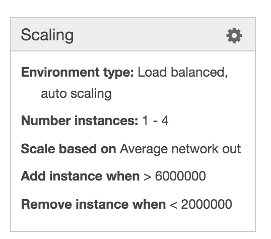

:doctype: article
:blank: pass:[ +]

:sectnums!:

= SEIS 665 Assignment 7: Elastic Beanstalk
Jason Baker <bake2352@stthomas.edu>
1.0, 4/8/2016

== Overview
During the last assignment, you built a complete 3-tier web application
deployment by manually configuring a VPC, RDS database, and an EC2 auto scaling
group. You probably figured out pretty quickly that this manual creation
process involves many different components and it's easy to make a mistake
during the configuration process.

This week's assignment has two parts. You will use the Elastic Beanstalk service
in the first part of the assignment to deploy another scalable web application.
You will learn how Platform as a Service can greatly simplify certain types of
application deployments

The second part of the assignment will focus on JSON and YAML. You will complete
a short set of exercises using each of these data formats.

== Requirements

You need to have a personal AWS account and GitHub account for this assignment.

== The assignment

It's time to launch some services on a PaaS.

=== Download WordPress application

You will need to download a WordPress application archive located at the
following URL:

  https://s3.amazonaws.com/seis665/wordpress.zip

The WordPress archive was configured in advance to properly deploy on
the Elastic Beanstalk service. Basically, the `wp-config.php` file was modified
to automatically set some key configuration values, such as the database
name and access information, based on the Elastic Beanstalk application
configuration.

=== Launch Elastic Beanstalk application

Elastic Beanstalk can greatly simplify an application deployment on AWS because
it takes care of much of the underlying infrastructure configuration. While the
service was originally designed for application developers with limited AWS
knowledge, it's really a valuable service for any AWS user. As IT professionals,
our goal is to build scalable, secure, and reliable IT services. A service
architecture built around a Platform as a Service allows us to achieve these
goals with greater repeatability and consistency.

Start out by going to the Elastic Beanstalk dashboard on AWS and clicking on
the *create new application* link. You will build the application configuration
by setting a number of application properties using the new application
wizard.

[NOTE]
====
It
doesn't matter which region you launch your services into as long as the
region is supported by Elastic Beanstalk. The us-east-1 or us-west-1 regions
are recommended.
====

[WARNING]
====
AWS is beta testing a new Elastic Beanstalk console. If you opt into or are automatically placed into this console you will need to follow the beta instructions.
====

Your application should use the following configuration settings:

  * Application name: *Wordpress application*
  * Elastic Beanstalk supports both web and worker applications. You will deploy
  a *web server*.

  * Predefined configuration: *PHP*. Why PHP? We could have
  selected any of the available platforms for this exercise. However, we are using
  a similar type of platform as the previous assignment so that you can better compare
  the amount of work required to stand up both web applications.

  * Environment type: *Load balancing, auto scaling*

  * Application version source: *Upload the wordpress.zip file*

  * Deployment policies: (keep defaults)

  * Environment name: *wordpress-<your username>* (must be unique!)

.Example
----
wordpress-jbaker
----

  * Create an RDS DB instance: Enabled

  * Configuration details:

    ** Instance type: t1.micro
    ** EC2 key pair: (select one of your pairs or create a new one)
    ** Application health check URL: *HTTP:80/readme.html*

  * Environment tag
    ** Key = *Product*
    ** Value = *Wordpress*

  * RDS Configuration
    ** DB engine: *mysql*
    ** Instance class: *db.t1.micro*
    ** Username: *wpdbadmin*
    ** Password: (choose an appropriate password)
    ** Retention setting: *Delete*
    ** Availability: *Single Availability Zone*

  * Permissions: (select default instance and service role)

Once you have entered in all the application settings, click the *launch* button.

====

*Beta Console Instructions*

If you are using the new Elastic Beanstalk console, use these settings:

* Application name: *Wordpress application*
* Tier: *Web Server*
* Platform: *PHP*
* Application Code: *Upload your code*
    ** Upload the wordpress.zip file

Click on the *Configure more options* button.

* Select the *Low cost* (Free Tier eligible) option.
* Select the *Modify* link under the Database box.
    ** Engine: *mysql*
    ** Engine version: *5.6.27*
    ** Instance class: *db.t1.micro*
    ** Storage: *10GB*
    ** Username: *wpdbadmin*
    ** Password: (your choice)
    ** Retention: *Delete*
    ** Availability: *Low*

Click the *Save* button, and then click the
*Create app* button.

====

Now monitor the launch events for the next fifteen minutes or
so. Notice how the Elastic Beanstalk service automatically configures
a load balancer, security group, auto scaling group, CloudWatch alarms,
and RDS instances for you. It's basically setting up everything you had to do
manually in the previous assignment. This method is much easier!

image:../images/assignment7/eb-events.png["600","600"]

Why don't we always just use Elastic Beanstalk to launch our applications?
Well, Elastic Beanstalk is great for certain kinds of applications, but it
certainly can't support every possible application architecture. You will
learn how to support more complex application architectures in an
automated fashion in future assignments.

You should see a URL listed at the top of the dashboard. The URL will look
something like this:

  wordpress-jbaker.us-west-1.elasticbeanstalk.com

or this if you are using the new console:

  Sample-env-1.vp3prx5kdx.us-west-2.elasticbeanstalk.com

Go ahead and click on the URL. A browser tab should open and you should be
able to see the Wordpress installation site. Configure the WordPress installation
like you did in the previous assignment. The settings don't have to be exactly
the same as last time. Congrats, you just launched a scalable WordPress site!

Let's check out how the Elastic Beanstalk service setup our application. Go
to the EC2 dashboard and look at the running instances. What do you notice?
Just one running instance. How come EB didn't create two instances?

In the
previous assignment, we setup an auto scaling group that required a minimum
of two instances at all times. Click on the Auto Scaling Groups menu item
and check out the scaling policies for the scaling group. How many minimum
and maximum instances are required in the scaling group? Under what conditions
will the scaling group increase or decrease the number of running instances?

Go back to the Elastic Beanstalk dashboard and select your application. Check
out some of the menu options on the left-side of the dashboard: Configuration,
Logs, Health, Monitoring, etc. Take a look at the monitoring section. Here you
can find overall health information for your application.

Next, click on the Configuration menu link and select the small gear icon
in the Scaling properties window.

You can modify the minimum or maximum
number of instances and the scaling policies in this section. Let's increase
the minimum number of instances to 2. In the Auto Scaling section, set
the following property:

  Minimum instance count: 2

Apply your changes after updating the instance count. You will now see that
Elastic Beanstalk is updating your application environment. Go to the EC2
dashboard and you will see that a new instance is launching.

====

*Beta Console Instructions*

In the scaling configuration page, change the environment type to: *Load balancing, auto scaling*.

Apply and save the change. Elastic Beanstalk will update your application environment and replace the existing EC2 instance. Wait until the updating is complete.

Once the new EC2 instance is in place, go back to the scaling configuration page and set the Auto Scaling Minimum instance count to: *2*.

Click the *Apply* button.

====

Go back to the Elastic Beanstalk dashboard and select your application. Wait
until the application health is OK (green).

image:../images/assignment7/eb-ok.png["600","600"]

Now, click on the application URL
to open the WordPress site in your browser. Hit the browser refresh button a
couple times. Your WordPress application is running on multiple instances --
just like the previous assignment.

Once you are satisfied that the web application is running properly, go
back to the scaling properties of the application configuration and change
the minimum instance count back to 1. After making the change, go to the EC2
dashboard and look at the running instances.

Um, shouldn't something be happening? Why isn't the auto scaling group setup
by Elastic Beanstalk terminating one of the instances? Give it a few more
minutes. You reduced the number of minimum instances to 1, but the number of
maximum instances is 4. Therefore, the minimum and maximum required instances
policy will have no impact on the two instances that are currently running.
However, after a few minutes the auto scaling group will automatically
terminate one of the instances due to a lack of requests being handled. Pretty
cool, huh?

You might be wondering how to go about updating the WordPress application in
the future. You can't just log into each server and upload new code. Well,
okay you could technically do that but anytime the auto scaling group
launches a new EC2 instance it will load the old version of your code on the
instance.

Elastic Beanstalk makes it really easy to upload new code on running instances.
If you go to the EB dashboard and select your application, you will notice
a button on the application dashboard titled *Upload and Deploy*. This
feature allows you to upload a new application archive. EB takes care of the
deployment process based on your predefined deployment settings. Awesome!

=== Collect session data

Connect to the running EC2 instance using a terminal program. Make a sub-directory
in the home directory called `assignment-7-elastic-beanstalk-<username>` (where <username> is your GitHub account name). Change to that directory and
create a Git repository (the Git client should already be installed on the server).

====

*Beta Console Instructions*

In the configuration section, select the Instances configuration options and set the key-pair to one that you have installed on your workstation.

Click the *Apply* button. This will cause Elastic Beanstalk to update the EC2 instance. Once the instance is updated, you should be able to log into the instance with your private key.

====

Next, configure the AWS CLI with your access key, secret key, and the current
region. Review the previous assignment if you don't recall how to configure the
CLI.

Run the following command to retrieve the Elastic Beanstalk events and store
the events in a JSON file:

  $ aws elasticbeanstalk describe-events > eb-events.json

=== Write YAML

We learned in our class that YAML was designed to be a more human readable
version of JSON (although I don't feel there's much of a difference in readability).
Convert the following JSON data to YAML format. Enter the converted data into
a file called `data.yaml` in the current directory.

{
  "Members": [
    "Steve",
    "Li",
    "Marcel"
  ],
  "active": true,
  "number": 3,
  "items": {
    "home": "table",
    "work": [
      "table", "chairs", "lamps"
      ]
  },
  "greeting": "Hello World"
}

=== Check your work

Here is what the contents of your git repository should look like before final submission:

====
&#x2523; data.yaml +
&#x2517; eb-events.json +
====

=== Save your work

Add the `data.yaml` and `eb-events.json` files to the Git repository. Commit
the files to the repository.

Create a new GitHub Classroom repository by clicking on this link: https://classroom.github.com/assignment-invitations/7b133d3aa0bc7920c4c6c116206e70e6

Configure your local Git repository to connect to this new GitHub repository. Push your work to GitHub and verify that the assignment files are located in the GitHub repository.

=== Terminate application environment

The last step in the assignment is to delete all the AWS services you created.
Unlike the previous assignment, removing these services is really easy since
everything is managed by Elastic Beanstalk. Simply go to the EB dashboard,
click on your application, and choose the terminate action. EB will terminate
and clean up all the AWS resources for you.

== Submitting your assignment
I will review your published work on GitHub after the homework due date.
