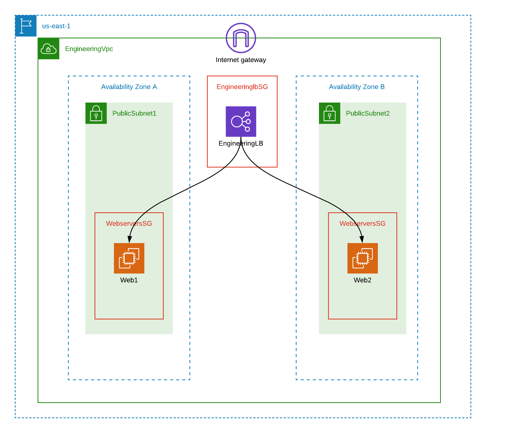

:doctype: article
:blank: pass:[ +]

:sectnums!:

= SEIS 615 Assignment 7: CloudFormation
Jason Baker <bake2352@stthomas.edu>
2.1, 8/10/2020

== Overview
In our class we discussed how IT professionals now design and provision infrastructure using
code -- a concept known as Infrastructure as Code. The AWS CloudFormation
service allows you to define cloud infrastructure using JSON template files.
These template files create resource stacks in AWS.

In this week's assignment, you will use AWS CloudFormation to create a
basic stack. Your stack will expand the stack design that was created during
the hands-on portion of the class. You will learn how code can simplify and ensure the repeatability of infrastructure
deployments. 

Some students feel that it takes more effort to create infrastructure using code versus manually 
creating infrastructure using a web console. That's probably true initially, especially when you are less familiar 
with infrastructure as code techniques. However, once you become experience with building infrastructure using code you
will find that it's faster and more reliable than a manual process.

When you build infrastructure manually you have to spend time documenting the infrastructure that you built, and this 
documentation needs to be maintained over time. Infrastructure as code is self-documenting and doesn't require this 
extra step. Once you spend the time writing code to build out an infrastructure environment, you can share it with others 
and generate copies of the environment within minutes. That's the power of infrastructure as code!

== Requirements

You need to have the following resources to complete this assignment:

  * Personal AWS account
  * GitHub account
  * Code editor

== The assignment

Your first stack awaits! Let's go.

=== Download CloudFormation template

This week's assignment isn't as prescriptive as some of the previous assignments and you will need to 
experiment with CloudFormation template code to build the required solution. Modifying template code requires a code
editor. Here is a list of some popular free editors:

  * Atom (https://atom.io/)
  * Visual Studio Code (https://code.visualstudio.com/)
  * Notepad++ (https://notepad-plus-plus.org/)

You can review the class powerpoint
presentation, AWS CloudFormation documentation, and YouTube resources if you
need help to figure out how to configure a resource. You may use the template below as a starting point for the assignment. 
Note that some of the existing resources in this template will need to be modified to meet the assignment requirements.
If you prefer, you can also build the template from scratch.

====
https://s3.amazonaws.com/seis615/BasicWebserverInVPC.json
====

Here's the background story for this assignment: The engineering manager at your office came to you and asked
if you could build a new CloudFormation stack template called `corpweb.json` for the development team. The stack must have
two Amazon Linux EC2 instances located behind an Application ELB. The
load balancer must handle incoming requests on port 80 and send those to the
EC2 instances on port 80. Additionally, the two instances need to be members of a security group which
allows incoming traffic on ports 22 and 80. 

The engineering manager would like users to be able to provide three *input parameters* when launching the stack:

  * A parameter called *InstanceType* that defines the instance type for the instances.
      ** The allowable type must be one of the following: t2.micro or t2.small
  * A parameter called *KeyPair* that specifies the server key-pair name for the EC2 instances.
  * A parameter called *YourIp* that specifies your public IP address in CIDR notation.

Also, she would like you to create an output called *weburl* that displays the load balancer DNS name
after the stack is launched.

The stack template should create the following logical resources:

  * A VPC with the logical name: *engineeringVpc*
    ** The VPC CIDR block should be: 10.0.0.0/18
    ** The VPC should have two public subnets with logical names: *publicSubnet1* and *publicSubnet2*.
        *** publicSubnet1 has a CIDR block of 10.0.0.0/24
        *** publicSubnet2 has a CIDR block of 10.0.1.0/24
    ** The subnets should be deployed in an architecture which maximizes service availability.
  * Two EC2 instances with logical resource names of *web1* and *web2* with associated *Name* metadata tags.
    ** web1 is located in the publicSubnet1 subnet.
    ** web2 is located in the publicSubnet2 subnet.
    ** Each instance type is based on the InstanceType input parameter.
    ** The instance AMIs should use this public image: *ami-3ea13f29*
    ** The instance key-pairs are based on the KeyPair parameter.
  * A security group with a logical name of *webserversSG* in the VPC.
    ** Allow incoming requests on port 22 from your workstation (based on the YourIp parameter).
    ** Allow incoming requests on port 80 from the engineeringlbSG.
  * An application load balancer with the logical name *engineeringLB* and target group with the logical name *engineeringWebservers*
    ** Load balance incoming requests on port 80 and send to instance port 80 using the http protocol.
    ** Load balancer health check via http on port 80 to the "/" url location.
  * The ALB is associated with a security group with the logical name *engineeringlbSG*.
    ** Allow incoming requests on port 80 from the Internet.

[NOTE]
====
The names of the resources you configure in your stack template must *exactly* match the values above. The names 
are case-sensitive, so a resource with the name of "Web1" is not the same as "web1". You will lose points on this 
assignment if your resource names do not match the expected names. You should always double-check your work.
====

=== Launch the stack

Once you have created and validated your template, save it to your local file
system. Next launch your new stack, called *WebserversDev*, in us-east-1 and provide the proper input parameters. 
Watch as AWS CloudFormation goes through the build process and creates the resources defined in the template. It will 
take a few minutes for CloudFormation to build the stack resources.

It's likely that your stack launch will fail to complete the first time you try
to launch the stack. Take a look at the events associated with the stack to try
to determine which resource CloudFormation failed to create properly. You will
see an error message describing why the resource failed. Oftentimes a resource
will not get built because the one of the resource properties is missing or is
incorrect. Try to fix the error in the template and launch the stack again.

When you see that the stack launch completed and the EC2 instances are running, go ahead and terminal into
one of the instances to confirm that you can access the server. Next, look at
the output value from the CloudFormation stack to determine the DNS address
for the load balancer that was created. Enter this DNS address into your
web browser to confirm that it is distributing requests across the instances
properly.

=== Check your work

Here is what the contents of your git repository should look like before final submission:

====
&#x2523; corpweb.json +
====

=== Save your work

Create a new GitHub Classroom repository by clicking on this link: https://classroom.github.com/a/XBiLBt8A

Commit your `corpweb.json` stack template file to this repository. You could create a new Git repository on your local machine, commit the template file to it, and then push the local repository up to GitHub. Or, you could use the GitHub web console to create a new repository and upload your template file to it. The
latter method is probably a little quicker for this assignment.

[WARNING]
====
You are responsible for ensuring that the corpweb.json template file you commit to your repository actually works on AWS 
CloudFormation. In the past, some students have used text editors which made small changes to the template when it was 
saved to disk and committed to the git repository. The result is that the template no longer worked properly on 
CloudFormation and the students' assignment scores were significantly impacted. *You should strongly consider testing 
the template after you commit it to the git repository to ensure that it still works.* 
====

=== Terminate application environment

The last step in the assignment is to delete all the AWS services you created.
Go to the CloudFormation dashboard, select your running stack, and choose the
delete option. Watch as CloudFormation deletes all the resources previously
created.

== Submitting your assignment
I will review your published work on GitHub after the homework due date.
