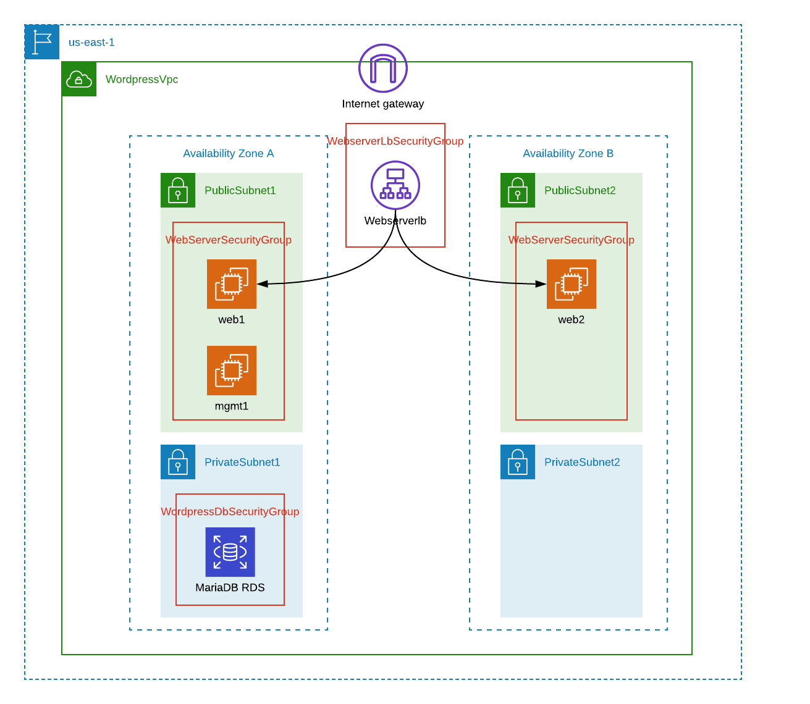

:doctype: article
:blank: pass:[ +]

:sectnums!:

= SEIS 665 Assignment 8: Configuration Management
Jason Baker <bake2352@stthomas.edu>
1.2, 11/2/2018

== Overview

Configuration management is an important methodology we use in IT to build and
maintain systems in our organizations. It helps us manage change more effectively
by leveraging key infrastructure as code principles. Instead of managing systems
with a complex graphical program storing data hidden away in a proprietary database,
we can use simple code scripts that are easy to read and place under version control.
In this assignment you will work with Ansible, one of the leading configuration
management tools in the marketplace.

== Requirements

You need to have a personal AWS account and GitHub account for this assignment.

== The assignment

Let's start managing our server configuration!

== Launch AWS resources

In this assignment you will revisit the Wordpress application again. This time we will try to automate most of the environment configuration using Cloudformation and Ansible. You will need to launch two EC2 instances and a MariaDB RDS database for this assignment. We will configure the first instance as a management server with the Ansible tool installed and the second instance will become the Wordpress webserver. We will use the RDS database as the Wordpress database server.

You can use a CloudFormation template to rapidly create many of the infrastructure
resources needed for this assignment. Unfortunately the template is incomplete and you will need to add a couple missing components. The template is available in this S3 bucket location:

  https://s3.amazonaws.com/seis665/AnsiblePress.json

Take a quick look at the template in a text editor. Notice how the UserData property for
the `mgmt1` instance is configured. When CloudFormation launches this stack, it will
automatically install and configure Ansible software on the management server. It's very
common to use a small amount of scripting code to bootstrap configuration management software
onto a new system. Once Ansible is installed it can be used to install and configure other
servers in the environment.

The CloudFormation template is missing a couple resources that you need to add:

    * An application load balancer with a logical name of `webserverlb` which distributes HTTP (port 80) requests to the `web1` and `web2` instances. The health check endpoint for the load balancer should be the root (`/`) directory.
    * A `db.t2.micro` RDS database instance (not a cluster) running a MariaDB 10.2.21 database called `wordpress` located in a private VPC subnet. Use the logical name `wordpressdb` for the CloudFormation RDS resource. RDS and EC2 instances actually pre-date the arrival of VPCs in AWS so confusingly there are two different ways to configure these resources. You need to make sure this database instance is designed to run inside a VPC with the proper database subnet group and security group resources defined.
    * A security group called `WordpressDbSecurityGroup` which allows incoming access on the standard MySQL port from the `WebServerSecurityGroup`
    * An input parameter called `DBName` which will define the database name to create (default to `wordpress`)
    * An input parameter called `DBUser` which will be used for the database server username.
    * An input parameter called `DBPassword` which will be used for the database server password.
    * A stack output called `wordpressDbEndpoint` which shows the MariaDB instance endpoint address.
    * A stack output called `wordpressLbEndpoint` which shows the application load balancer URL.

[WARNING]
====
In the workplace we would never pass in usernames and passwords (secrets) into a template using input parameters. This is way too insecure. However, I think this is okay for a learning exercise. We definitely would never hard-code credentials into code which is checked into a repository.
====

The environment we need to create with CloudFormation will look something like this:

Launch a new stack using the modified `AnsiblePress.json` template into the us-east-1 region. You can give the stack any name you like. When you create the stack, you will need to click a checkbox acknowledging the creation of IAM resources.

You will use the Ansible software installed on `mgmt1` to configure the `web1` system. Ansible communicates with remote hosts using the SSH protocol which means that the proper access credentials need to be in place on `mgmt1` in order to establish shell connections with the other servers. Fortunately, the CloudFormation stack automates the setup of ssh credentials on `web1`.

== Test Ansible

Log into the `mgmt1` instance and create a new directory in your home directory called `assignment8`. Initialize a new Git repository in this directory.

Ansible uses an inventory file to track managed hosts. The inventory file specifies how Ansible should connect to a remote host. It usually contains the IP address or fully-qualified domain name of a host, as well as the username and key required to access a host. The `hosts` file was dynamically created by an EC2 userdata script, so it already contains the IP address of the `web1` instance. Take a look at the hosts file located at `/etc/ansible/hosts`.

You can verify that Ansible can successfully access managed hosts by typing the
following commands:

    $ ansible all -m ping

You should see a response from Ansible that looks like this:

  web1 | SUCCESS => {
      "changed": false,
      "ping": "pong"
  }

If Ansible returns a successful `pong` for the `web1` host then you are ready to move on!

== Configure servers

You will create an Ansible playbook to configure the web1 and web2 instances as Wordpress webservers. Before beginning the playbook, take a look at the facts that Ansible can collect from a remote host:

    $ ansible web1 -m setup

You can create a playbook file on the `mgmt1` server using a local text editor like nano or vi. Alternatively, you can use your favorite source code editor on your local workstation and copy (scp) the file from your local workstation to the `assignment8` directory on `mgmt1`. Use whichever method is easiest for you.

Create a playbook called `playbook.yml` in the `/home/ec2-user/assignment8` directory. The playbook should contain two plays. The first play (named `install apache`) will install the Apache webserver and additional PHP software packages. The second play (named `install wordpress`) will install and configure the Wordpress application.

Here are the tasks you should configure in the first play:

    * Update all the current software packages on the system.
    * Install the `httpd`, `php7.2`, and `lamp-mariadb10.2-php7.2` software packages using the following :
      ** Run the command `amazon-linux-extras install -y lamp-mariadb10.2-php7.2 php7.2`
      ** Use the yum module to install the `httpd` (Apache) package
    * Start the Apache web service and configure it to automatically start on system boot.

[WARNING]
====
While Ansible can run shell commands on servers using the `shell` or `command` modules, in general we try to avoid using shell commands in playbooks as much as possible because shell commands tend to be less maintainable. Playbooks are not shell scripts. You should not have more than one shell command in this playbook.
====

Note that the `ec2-user` user doesn't have the necessary permissions to install new services on the instance. Ansible will need to become a super-user on these systems in order to install new packages.

Here are the tasks you should configure in the second play:

    * Download the wordpress software from the URL `https://wordpress.org/latest.tar.gz` and save it to the file location `/var/www/wp.tar.gz`
        ** There are a couple different Ansible modules you can use to download files from the Internet. You can choose any one you want.
    * Unarchive the Wordpress software package to the directory `/var/www/html`
        ** Hint: Look at using the `unarchive` module.
    * Create the Wordpress configuration file (`/var/www/html/wordpress/wp-config.php`) on `web1` using the Jinja template called `wp-config.j2` located in the `/home/ec2-user/ansible_templates` directory on the `mgmt1` server.

The Jinja template engine allows us to take template files and automatically interpolate the value of variables in the template. The values of the interpolated variables are provided by Ansible. If the variable name in an Ansible play and the variable name in the template match, Ansible will swap out the template variable name with the value of the Ansible variable. This is really handy because it means we can convert application configuration files into templates which can be parameterized and reused.

Review the Jinja template on the `mgmt1` server and notice how it's using the following variables: database_name, database_username, database_password, database_endpoint. The values of these variables must be set in the Ansible playbook before the template is processed. If you are struggling to understand how to use Ansible templates, check out the basic tutorial at http://www.mydailytutorials.com/ansible-template-module-examples/.

Where do the values for these variables come from? You set these values in the CloudFormation stack which created the environment. Fortunately these values were also injected into the `mgmt1` instance by the USER_DATA script. Run the command `env` at the command line on `mgmt1` and notice how there are a set of environment variables beginning with `DATABASE` which contain the values from your CloudFormation stack. 

Your playbook can use these environment variable values to create a set of variables that the template engine will use to generate the proper Wordpress configuration file (`wp-config.php`). For example, if you wanted to create a variable in your template called `foo` and set it to the value of an environment variable called `BAR`, you could use this syntax in the template:

    vars:
      foo:  '{{ lookup("env", "BAR") }}'

Once you have written the plays in the playbook, execute the playbook to configure the `web1` and `web2` hosts. If you encounter any error messages, review the playbook script and correct any mistakes. Configuration tools like Ansible are designed to be idempotent, meaning that you should be able to run the playbook multiple times. If for some reason the servers are hopelessly misconfigured and you want to start over, you can always delete your CloudFormation stack and create a new one.

You should confirm that all the configuration tasks have been applied to the `web1` and `web2` servers and that the wordpress application is accessible via the application load balancer before submitting your work.

=== Save your work

Create a new GitHub Classroom repository by clicking on this link: https://classroom.github.com/assignment-invitations/68c6b367013ed3711b1b1c9aa7bf8678

Commit the contents of the `assignment8` directory to this repository, including the CloudFormation template you modified earlier in the assignment.

=== Check your work

Here is what the contents of your git repository should look like before final submission:

====
&#x2517; playbook.yml +
&#x2517; AnsiblePress.json +

====

=== Terminate application environment

The last step in the assignment is to delete all the AWS services you created.
Go to the CloudFormation dashboard, select your running stack, and choose the
delete option. Watch as CloudFormation deletes all the resources previously
created.

== Submitting your assignment
I will review your published work on GitHub after the homework due date.
