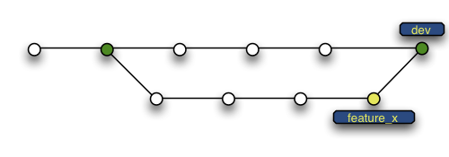
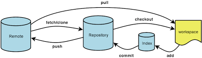
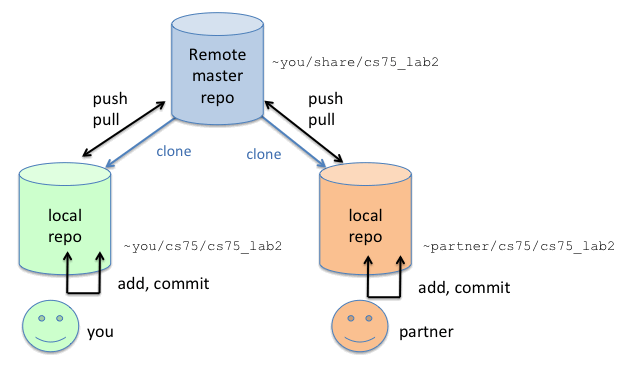

:doctype: article

:sectnums!:

== Git Hands-on Guide
Jason Baker <bake2352@stthomas.edu>
2.0, 8/26/2021

=== Overview
The purpose of this guide is to provide a basic overview of the Git version
control system. The goal is to get students familiar with core Git functions
and version control processes. For more detailed information, see the Git
reference manual at https://git-scm.com/documentation.

You can also refer to the https://github.com/jasondbaker/infrastructure-class/blob/main/articles/git-cheat-sheet-education.pdf[Git command cheat sheet] for a concise summary of commands.

=== The git command
Git commands are executed by typing `git` followed by a function
and a series of attributes. Many of the `git` command functions only work properly if
the git command is executed in a file directory containing a Git repository.

.Example:
----
git status
----

=== Getting help
Typing in the `git` command with no arguments provides you with a
helpful summary of available command options. You can also type
`git help <command>` to get more specific information about a
particular command.

.Example:
----
git help status
----

=== Creating a repository
Create a Git repository in a new or existing file directory using:
`git init`

  * Creates a hidden sub-directory in your current directory
  called “.git” that contains the directory files and all changes
  to those files

  * The current directory is now your working directory

=== Adding files to the staging area
Add files in the curent working directory to the staging area using:
`git add <filename>`

.Example:
----
git add index.html
----

  * Important: this just adds the file to the temporary staging
  area, *not* the repository.

  * If you create a Git repository in an existing directory, the
  files are *not* automatically added to the staging area or repository.

  * Once a file is added to the staging area, Git will track all future
  changes to the file. A file only needs to be added once. It's possible
  to stop tracking a file so that changes to the file don't get added to
  the repository.

A handy command option to add all of the files in the current directory to the Git
staging area is: `git add -A`

=== Viewing state of files in current working directory
The files in the current working directory could be in the
repository, in the staging area, or neither (untracked). Display
the state of the files by typing: `git status`

  * Files in the staging area are queued up for committing to the repository.

=== Removing staged files
If you accidentally added a file to the staging area, you can remove the file using the `git reset HEAD <filename>` command. This command seems a little strange, but it works!

.Example:
----
git reset HEAD index.html
----

=== Adding files (committing) to the repository
Committing files to the repository creates a _snapshot_ of all the tracked
files in the current working directory. Commit files to the repository by
typing: `git commit -m 'commit message'`

.Example:
----
git commit -m 'refactor data processing module'
----

  * The commit message should succinctly describe the file changes made
  in your commit.

  * Each commit creates a hash (something like _bc264fb37d88bbde1adc25ba8337f7f929c85d02_) which is
  used to reference the commit in future operations.

=== Amend a commit
Sometimes after you add a commit to the repository you realize that you forgot to
stage all of the changed files. You could stage the remaining changed files and
issue another commit, but then your repository contains multiple commit messages
for one set of changes. Another option is to amend the previous commit using
the `git commit --amend` command. This command modifies the previous commit by adding additional changed files.

.Example:
----
git commit --amend
----

=== Removing files from the repository
Every change made to the repository is additive -- even deletions. Remember,
commits are simply snapshots of the current working directory. If a previous
commit is restored, then files that were subsequently deleted will reappear.
This is a very good thing!

  * It is technically possible to erase files from the repository, but this
  requires changing the repository history. Just like in the movies, when you
  go back in time and start changing things bad stuff can happen.

  * Many organizations expressly forbid users from manipulating git history.

  * Assume everything you commit to the repository is permanent.

=== Reverting file changes
Once a file is committed to a repository, you can easily revert future changes made to that file. For example, let's say you are working on an `index.html` file. You make some changes to the file and it no longer works as expected. You want to revert it back to its original state before you made changes to it. The following command allows you to revert back to the previous state of the file: `git checkout -- <filename>`. Note, this command is very dangerous because it overwrites saved data. You should know what you are doing when you issue this command.

.Example:
----
git checkout -- index.html
----

=== Reverting to a previous commit
Let's say that you made a commit to the git repository but you accidentally committed the wrong file changes. Your commit history now looks like the following diagram, where `C` represents your unwanted commit.

   (F)
A-B-C
    ↑
  main

You can reverse the changes made by the commit by using the `git revert <commit hash>` command. This command creates a new commit that reverses the changes made in the specified commit. Your commit history will now look like the following diagram, where `D` represents a new commit that reverses the changes made in the `C` commit (or whatever commit you specify):

     (F)
A-B-C-D
      ↑
    main

Sometimes you might want to reverse a commit and remove the commit and its file changes from the repository. It's like the commit never happened. You can revert back to the previous commit and state of your file system by using the command: `git reset --hard HEAD~1`

Note that this command is a little dangerous and you will lose the changes made in your most recent commit. Your commit history will now look like the following, where `B` represents the previous (and now current) commit:

 (F)
A-B
  ↑
main

It's possible to revert to the previous commit without changing the current status of the files. In other words, you can revert the repository back to the time right before you issued the last commit. All the files will still contain the changes you recently made. You can perform this type of soft revert by using the command: `git reset --soft HEAD~1`

=== Viewing list of commits to repository
Display the list of commits in the repository by typing: `git log`

.Example:
----
git log

commit df4a36555abacf9c2fdf20e8fb6bb5e00177a616
Author: Jason Baker <bake2352@stthomas.edu>
Date:   Sun Mar 20 17:00:03 2016 -0500

    additional work on linux guide

commit b9eb5e5a92fa99e351ca1a8b1aa2d15507a782c2
Author: Jason Baker <bake2352@stthomas.edu>
Date:   Sat Mar 19 22:05:13 2016 -0500

    create linux hands on guide
----

If your repository contains dozens or hundreds of commits, the standard log listing can get pretty long. You can generate a shorter, more concise log listing using the command: `git log --oneline`

== Branching
Branching is super easy in Git and one of the reasons it is so popular. A branch
is like a separate path in a timeline. Branches are used to test out new features
or bug fixes without cluttering up the main development code base.

  * Every new repository starts out with a default branch called *main*.

  * Every commit has to be made against a branch.

=== Create a new branch
Create a branch by typing in the command: `git branch <name>`

.Example:
----
git branch test
----

  * It's common practice to create a new branch for every feature or bug fix you
  are making on your code base.

  * A common naming convention is to precede a branch name with a category.

.Example:
----
git branch features/update-branding
----

  * Making all your commits against the main branch is a lazy and discouraged practice.

=== Listing current branches in the repository
Display a list of the current branches in the repository by typing `git branch --list` or
simply `git branch`. The listing will denote the currently checked out branch using
the asterisk character (`*`).

.Example:
----
git branch

* main
testing
----

=== Switching branches
It's easy to switch to a different branch by typing: `git checkout <branch name>`

  * A nice shortcut is to create a new branch and switch to it as the same time:
  `git checkout -b <new branch>`

.Example:
----
git checkout -b testing
----

=== Merging branches
Eventually, you may want to merge one branch into another. For example, you might
want to take a feature branch and merge it into a develop branch so that other team
members can use it. To merge a branch into the existing checked out branch type: `git merge <branch name>`

.Example:
----
git checkout main
git merge develop
----

In this example, the main branch is checked out and the develop branch is merged
into the main.

  * Sometimes merging doesn't go smoothly because of conflicts. The branches you want
  to merge contain a file with the same name, but _overlapping_ content. In this case
  you need to tell git which conflicting pieces of content belong in the merged branch.
  Dealing with conflicts can be a bit tricky and is outside the scope of this guide.

=== Deleting a branch
To delete an existing branch, type: `git branch -d <branch name>`

.Example:
----
git branch -d testing
----

  * Git will produce a warning if you try to delete a branch that contains unmerged
  files. Git tries to prevent you from accidentally deleting files.

=== Comparing changes in commits
It's useful to be able to see the changes made to files in specific commits or see the differences between two different commits. The `git diff` command allows you to see these differences.

To see the file changes made in a specific commit, use the `git diff <commit hash>` command. For example:

  git diff f83d738

This command will display a list of changes made in the commit:

----
index d23b06e..e795bc2 100644
--- a/index.html
+++ b/index.html
@@ -1,5 +1,5 @@
 <html>
   <body>
-    <h1>Hello World</h1>
+    <h1>Hello Great World</h1>
   </body>
 </html>
diff --git a/site.xml b/site.xml
new file mode 100644
index 0000000..e69de29
----

In this example, the word `Great` was added to the html code and a new file called `site.xml` was added to the file directory.

You can compare the changes between two different commits by using the command: `git diff <hash>..<hash>`. For example:

  git diff f83d738..HEAD

This command compares the file changes made between the f83d738 commit and the current HEAD.

Finally, you can also easily compare the file changes between two different branches using the command: `git diff <branch name>..<branch name>`. For example:

  git diff main..develop

Note that the diff command output can be a little bit cryptic depending on the number of changes present in the commits being analyzed. Oftentimes it is more helpful to use a graphical diff tool to review file changes.

=== Collaboration
The basic commands describe how to establish and manage a local git repository.
But when backing up the local repository to a remote server or when collaborating
with a team, it's important to understand how to clone, push and pull repositories.

=== Cloning an existing repository
Cloning a repository allows you to copy an existing git repository from a remote
host (git server) to your local computer. Clone a repository by typing: `git clone <repository address>`

.Example:
----
git clone https://github.com/jasondbaker/infrastructure-class.git
----

This example will download a repository from GitHub and store it in
a sub-directory called *infrastructure-class* within the current file directory.

  * Every developer on a team project clones the project repository from a central
  server and works with their own local copy.

  * Cloning a repository copies every file and *every* change ever made to the
  repository.

  * The central git server is usually called the *_origin_*.

=== Pushing a branch to a remote server
Pushing a local repository branch allows you to share your code changes with
other team members or back up your code to a remote system. Push a branch by
typing: `git push origin <branch name>`

.Example:
----
git push origin develop
----

=== Pulling a branch from the remote server
Over time the repository on the central server will get out of sync with
your local clone of the repository as other developers push their code updates.
Sync your current branch with the central server by typing: `git pull <repository name>`

git pull https://github.com/jasondbaker/infrastructure-class.git

  * When working with a team using a remote server, you establish a routine of
  pushing and pulling updates periodically from the remote server -- possibly
  daily or even hourly.

=== Rebasing a branch
Sometimes you are working on a branch and you want to incorporate new features
added by another team member in a parent branch. This is a very common occurrence
in a team environment. Rebasing allows you to update your branch with their
changes while _replaying_ your code changes on top of theirs. Rebase a branch by
using the command: `git rebase <parent branch> <rebase branch>`

.Example:
----
git rebase develop feature/cool-widget
----

This example takes the commits in the *cool-widget* branch and moves them to
the front (known as the HEAD) of the *develop* branch. This will only work if
the develop branch is the parent of the cool-widget branch. It's possible to
take a branch of code and move it to an unrelated branch. This process is
called _cherry-picking_.

image:../images/git-hands-on/git-hands-on-rebase.png[]
