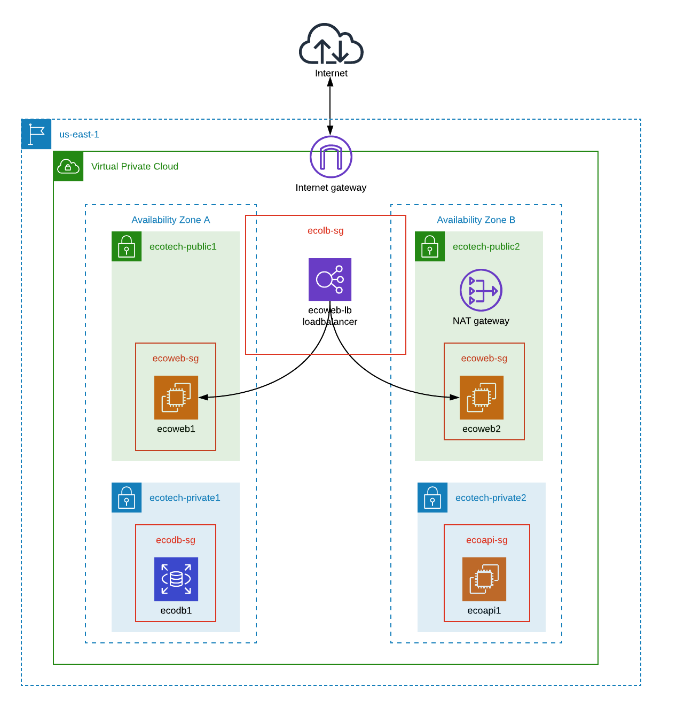

:doctype: article
:blank: pass:[ +]

:sectnums!:

= SEIS 615 Week 4 Project: VPC
Jason Baker <bake2352@stthomas.edu>
2.0, 8/10/2020

== Overview
Setup an AWS VPC and ELB.

== Requirements

  * AWS account.
  * SSH terminal application.

== The project

Let's get started!

=== Create a VPC

Create a VPC with the following resources and architecture:

The VPC (`ecotech-vpc`) exists in the us-east-1 region, uses a network CIDR block of 10.25.0.0/16 and is partitioned into 4 subnets:

* ecotech-public1 (10.25.1.0/24)
* ecotech-public2 (10.25.2.0/24)
* ecotech-private1 (10.25.3.0/24)
* ecotech-private2 (10.25.4.0/24)

Each availability zone contains a public subnet and a private subnet. The exact AZs don't make a 
difference, as long as the AZs are different.

Create an Internet Gateway for the VPC.

Create a NAT gateway in the `ecotech-public2` subnet. Configure the routing tables for the public subnets and private subnets. 
Do you remember which subnets route through the Internet Gateway and which subnets route through the NAT gateway? 

You might be wondering why there is only a single NAT gateway. In a production environment you would probably configure a separate NAT gateway running in each availability zone. However, for this project we are just using a single gateway because it's less expensive.

=== Create EC2 instances

Create three EC2 instances with the following properties:

* t2.micro instance size
* AMI: **ami-598b6124** (note that this is a public community image)
* 10GB root volume storage size
* Instances are named `ecoweb1`, `ecoweb2`, and `ecoapi1`
* The web instances should launch into ecotech public subnets in separate AZs, and the API instance should launch into the ecotech-private2 subnet.
* The web instances should have public IP addresses and the API instance should only have a private IP.
* The web instances are associated with a security group called `ecoweb-sg`. This security group should allow:
  - Incoming traffic on port 80 (http) from the Internet.
  - Incoming traffic on port 80 (http) from the ecolb-sg security group.
  - Incoming traffic on port 22 (ssh) from your workstation (use http://checkip.amazonaws.com to determine your
  IP address).
* The API instance is associated with a security group called `ecoapi-sg`. This security group should allow:
  - Incoming traffic on port 80 (http) from the ecoweb-sg security group.
  - Incoming traffic on port 22 (ssh) from the ecoweb-sg security group.

=== Create ELB

Create an Application Elastic Load Balancer with the following properties:

* Listen on port 80 (http)
* Perform a health check on port 80 to the URL endpoint: `/index.php`
* ELB is associated with a security group called `ecolb-sg`. This security group should allow:
  - Incoming traffic on port 80 (http) from the Internet.
* Setup a target group called `ecotech-webservers` and associate webserver instances with the group.

Verify that you can access the webservers by going to the ELB endpoint address in your web browser. Refresh your browser to see the ELB distribute the request to a different instance each time.

=== Fail over instances

Simulate a failure of one of the instances by stopping the instance. Verify the status of the instance in the ELB target group. Access the ELB endpoint in the browser to verify that the ELB is no longer distributing requests to the failed instance.

=== Access the API server

Verify that you can access the API server by logging into one of the public web servers and running the command:

  curl <private IP address of ecoapi1>
  
where you substitute the private IP address of the ecoapi1 server in the command string.

=== Extra super-duper really fun task (optional)

Launch a single-instance MySQL RDS instance called `ecodb1` into the private1 subnet. Start by creating a database subnet group called `ecotech-db-group` and select the private1 subnet in the ecotech VPC. The purpose of the database subnet group is to define which subnets the RDS service may launch instances into. 

Next, create a security group for this RDS instance called `ecodb-sg`. Setup the security group to allow traffic from the webservers to the RDS instance over port 3306.

Finally, create an RDS instance and specify the database subnet group and security group you created above in the instance configuration.

Verify that you can reach the database service endpoint from one of the webservers. One way to verify this connectivity is to shell into an EC2 instance and run the *nc* command which is a diagnostic tool you can use to test network connectivity:

  sudo yum install nc -y
  nc -vz <RDS instance endpoint> 3306

where you substitute the actual RDS endpoint address in the command string.

=== Show me your work

Please show me your VPC subnet and ELB configuration.

=== Terminate AWS resources

Remember to terminate your EC2 instances, RDS instance, ELB, and NAT gateway. Delete the VPC and all of the network components it created.
