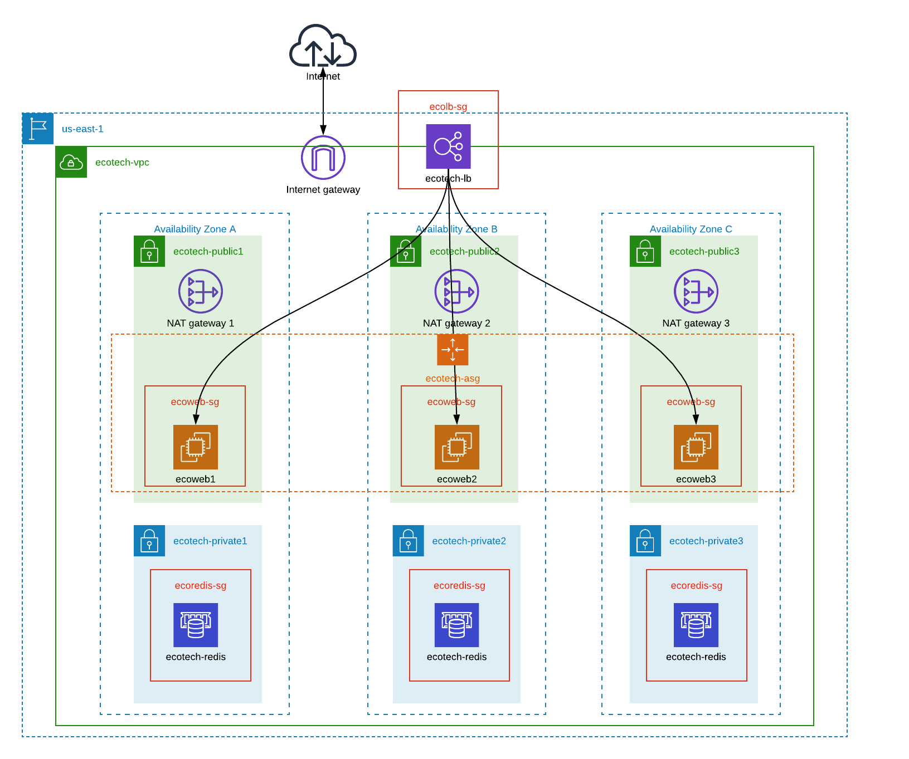

:doctype: article
:blank: pass:[ +]

:sectnums!:

= SEIS 665 Week 5 Project: Autoscaling
Jason Baker <bake2352@stthomas.edu>
1.0, 2/24/2018

== Overview
Create an infrastructure architecture which utilizes the EC2 autoscaling service.

== Requirements

  * AWS account.
  * SSH terminal application.

== The project

Let's get started!

=== Autoscaling architecture

Create a VPC with the following resources and architecture:

The VPC (`ecotech-vpc`) exists in the us-east-1 region, uses a network CIDR block of 10.25.0.0/16 and is partitioned into 
6 subnets (3 public and 3 private):

* ecotech-public1 (10.25.1.0/24)
* ecotech-public2 (10.25.2.0/24)
* ecotech-public3 (10.25.3.0/24)
* ecotech-private1 (10.25.4.0/24)
* ecotech-private2 (10.25.5.0/24)
* ecotech-private3 (10.25.6.0/24)

Each AZ has a pair of subnets -- one public and one private. The exact AZs don't make a difference, as long as the AZs are different.

Create an Internet Gateway for the VPC.

Create a NAT gateway in each of the public subnets. Configure the routing tables for the public subnets and private subnets. You should know by now which subnets route through the Internet Gateway and which subnets route through the NAT gateway.

=== Create Application ELB

Create an Application Elastic Load Balancer with the following properties:

* Listen on port 80 (http)
* Perform a health check on port 80 to the URL endpoint: `/`
* ELB is associated with the `eco-elb-sg` security group.
  ** Allows port 80 (http) traffic from the Internet
* Setup a target group called `ecotech-webservers`, but don't associate any EC2 instances
with the target group.

=== Create Autoscaling Group

Create an EC2 autoscaling group configuration called `ecotech-asg` which runs 3 EC2 instances at all times. I recommend
creating the security group for the autoscaled instances first. Create a security group called `ecoweb-sg` with the
following incoming traffic rules:

* Incoming traffic on port 80 (http) from the `eco-elb-sg`.
* Incoming traffic on port 22 (ssh) from your workstation (remember to use http://checkip.amazonaws.com).
 
The autoscaling group should use a launch configuration with the following properties:

* t2.micro instance size
* Latest version of Amazon Linux 2 AMI 
* IP Address Type: `Assign a public IP address to every instance.`
* 10GB root volume storage size
* Instances are named `ecoweb`
* The instances will run in the ecotech-vpc
* Configure User Data to run the following script:

  #!/bin/bash
  yum update -y
  amazon-linux-extras install nginx1.12 -y
  systemctl start nginx.service

* The three instances should launch into public subnets in separate AZs.
* The instances are associated with the existing `ecoweb-sg` security group called `ecoweb-sg`.
* Enable load balancing on the group by associate the Autoscaling group with the `ecotech-webservers` target group.

Once you have created the autoscaling group, go to the EC2 console and watch AWS
launch each of your webservers. Verify that the webservers are passing the ELB
health check.

=== Create Redis Cluster

Create a new security group called `ecoredis-sg` which allows incoming
port 6379 (redis) traffic from the `ecoweb-sg`.

Create a new Redis cluster using the ElastiCache service. The cluster should have
the following properties:

* Cluster engine: Redis
* Name: ecotech-redis
* Port: 6379
* Type: cache.t2.micro
* Number of replicas: 3
* Subnet group name: ecotech-redis-group
* Launch in the ecotech-vpc
* Select the 3 private subnets
* Select the ecoredis-sg security group

After creating the redis cluster, verify that the EC2 instances can communicate with
redis by running the following command on one of the EC2 instances:

  nc -vz <redis service endpoint> 6379

where you substitute the actual elasticache endpoint address in the command string. If the `nc` program isn't
found then install it using `yum`. 

=== Harder Faster Stronger task (optional)

Create a Python script (or Ruby/ Node/ Go) on one of the webservers which uses the redis-py client (https://redis-py.readthedocs.io/en/latest/) to create a key called `count` in the redis cluster, and increment the key each time the script is executed.

=== Show me your work

Please show me your autoscaling group and redis configuration.

=== Terminate AWS resources

Remember to terminate all the resources created in this project!
