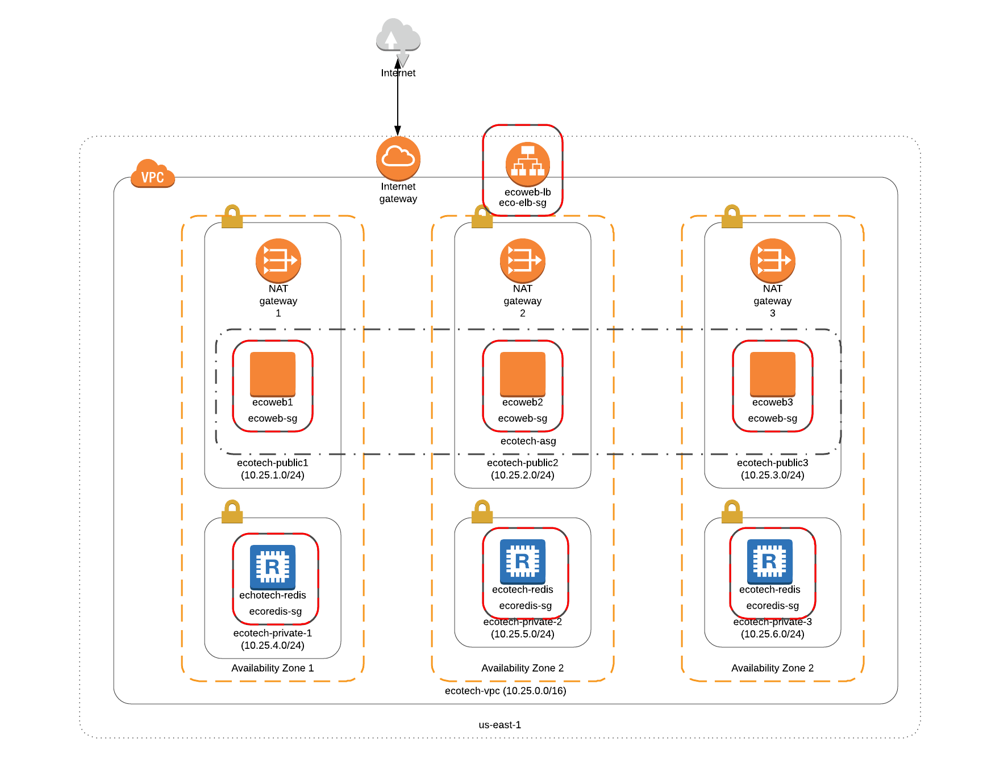

:doctype: article
:blank: pass:[ +]

:sectnums!:

= SEIS 665 Week 5 Project: Autoscaling
Jason Baker <bake2352@stthomas.edu>
1.0, 2/24/2018

== Overview
Launch a CloudFormation template and review the resources created by the CloudFormation service. Create an infrastructure architecture which utilizes
the EC2 autoscaling service.

== Requirements

  * AWS account.
  * SSH terminal application.

== The project

Let's get started!

=== Launch a CloudFormation template.

Open up the CloudFormation web console and create a new stack by specifying the following S3 URL:

  https://s3.amazonaws.com/seis665/docker-single-server.json

The template will create a stack containing a number of AWS resources:

* An AWS Virtual Private Cloud (VPC) including a subnet, routing table, routes, an Internet gateway, and a security group.

* A single EC2 instance.

After clicking on the launch link, click the *Next* link:

On the stack *Specify Details* page, enter the following:

1. In *Stack name*, the value should be `mystack`.
2. In *Key Name*, select the name of your Amazon EC2 key pair.

Click the *Next* button.

On the *Options* page just click *Next*.

On the *Review* page, review the settings. Finally, click the *Create* link.

It will take a few minutes for CloudFormation to create the AWS resources for you. You can watch the progress messages on the *Events* tab in 
the console. When the stack has been created, you will see a CREATE_COMPLETE message in the *Status* column of the console and on the 
*Overview* tab.

Review the stack outputs by looking at the resources in the `Outputs` tab. Take a look at the resources created by the template by going to the VPC web console and the EC2 web console. When you are finished reviewing
the resources go ahead and delete the stack.

=== Autoscaling architecture

Create a VPC with the following resources and architecture:

The VPC (`ecotech-vpc`) exists in the us-east-1 region, uses a network CIDR block of 10.25.0.0/16 and is partitioned into 
6 subnets (3 public and 3 private):

* ecotech-public1 (10.25.1.0/24)
* ecotech-public2 (10.25.2.0/24)
* ecotech-public3 (10.25.3.0/24)
* ecotech-private1 (10.25.4.0/24)
* ecotech-private2 (10.25.5.0/24)
* ecotech-private3 (10.25.6.0/24)

Each AZ has a pair of subnets -- one public and one private. The exact AZs don't make a difference, as long as the AZs are different.

Create an Internet Gateway for the VPC.

Create a NAT gateway in each of the public subnets. Configure the routing tables for the public subnets and private subnets. You should know by now which subnets route through the Internet Gateway and which subnets route through the NAT gateway.

=== Create Application ELB

Create an Application Elastic Load Balancer with the following properties:

* Listen on port 80 (http)
* Perform a health check on port 80 to the URL endpoint: `/`
* ELB is associated with the `eco-elb-sg` security group.
  ** Allows port 80 (http) traffic from the Internet
* Setup a target group called `ecotech-webservers`, but don't associate any EC2 instances
with the target group.

=== Create Autoscaling Group

Create an EC2 autoscaling group configuration called `ecotech-asg` which runs 3 EC2 instances at all times. The
autoscaling group should use a launch configuration with the following properties:

* t2.micro instance size
* Latest version of Amazon Linux 2 AMI 
* 10GB root volume storage size
* Instances are named `ecoweb`
* The instances will run in the ecotech-vpc
* Configure User Data to run the following script:

  #!/bin/bash
  yum update -y
  yum install nginx -y
  service nginx start

* The three instances should launch into public subnets in separate AZs.
* The instances are associated with a security group called `ecoweb-sg`. This security group should allow:
  - Incoming traffic on port 80 (http) from the `eco-elb-sg`.
  - Incoming traffic on port 22 (ssh) from your workstation (remember to use http://checkip.amazonaws.com).

* Enable load balancing and associate the Autoscaling group with the `ecotech-webservers` target group.

Once you have created the autoscaling group, go to the EC2 console and watch AWS
launch each of your webservers. Verify that the webservers are passing the ELB
health check.

=== Create Redis Cluster

Create a new security group called `ecoredis-sg` which allows incoming
port 6379 (redis) traffic from the `ecoweb-sg`.

Create a new Redis cluster using the ElastiCache service. The cluster should have
the following properties:

* Cluster engine: Redis
* Name: ecotech-redis
* Port: 6379
* Type: cache.t2.micro
* Number of replicas: 3
* Subnet group name: ecotech-redis-group
* Launch in the ecotech-vpc
* Select the 3 private subnets
* Select the ecoredis-sg security group

After creating the redis cluster, verify that the EC2 instances can communicate with
redis by running the following command on one of the EC2 instances:

  nc -vz <redis service endpoint> 6379

where you substitute the actual elasticache endpoint address in the command string.

=== Show me your work

Please show me your autoscaling group and redis configuration.

=== Terminate AWS resources

Remember to terminate all the resources created in this project!
