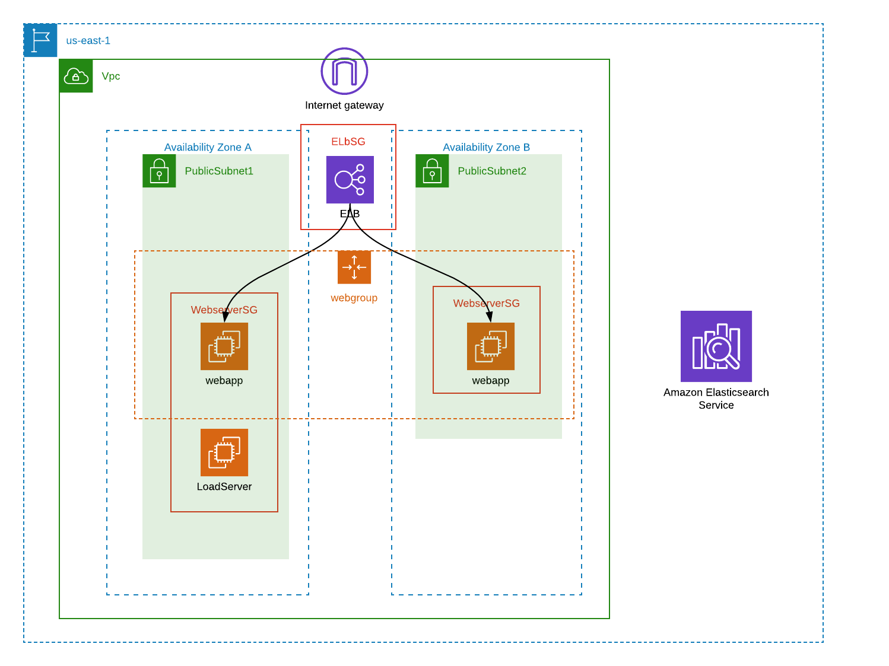

:doctype: article
:blank: pass:[ +]

:sectnums!:

= SEIS 665 Week 6 Project: Telemetry
Jason Baker <bake2352@stthomas.edu>
1.0, 8/28/2019

== Overview
Telemetry plays a key role in every Devops organization. Teams rely on telemetry collection and analysis as a feedback mechanism to understand how a service is performing. As teams deploy code changes to a service, metrics allow teams to understand how these changes are impacting the service. 

Nearly every modern application generates a set of application log data which describes application events and failures. Engineers review application logs when trying to diagnose service problems. In this week's project we will utilize a common ELK stack architecture to ingest and analyze log information from a server. 

== Requirements

  * AWS account.
  * SSH terminal application.

== The project

Let's get started!

=== Launch a CloudFormation template.

We're going to get a little preview of CloudFormation, a tool we will learn much more about in a few weeks.
CloudFormation allows us to quickly create sets of resources called stacks. Log into your AWS account and click on
the link below:

  https://us-east-1.console.aws.amazon.com/cloudformation/home?region=us-east-1#/stacks/create/review?templateURL=https://s3.amazonaws.com/seis665/elastic-template.json&stackName=ElasticStack&param_asgsize=2&param_webami=ami-079812e07590598ca

You will see a quick create stack page showing the name of the stack and a list of
input parameter values. Set the following parameter values:

  * KeyName should be set to the name of your EC2 keypair.
  * YourIp should be set to your workstation's IP address in x.x.x.x/32 CIDR notation (use checkip.amazonaws.com to verify)

Select the checkbox next to *I acknowledge that AWS CloudFormation might create IAM resources with custom names.* Click the *Create Stack* button.

The template will create a stack containing several resources:

* An AWS Virtual Private Cloud (VPC) including two subnets, routing tables, routes, and
an Internet gateway.

* A single-node Elasticsearch instance.

* An application load balancer targeting a set of EC2 instances running the Nginx webserver.

It will take a few minutes for CloudFormation to create the AWS resources for you. You can watch the progress messages on the *Events* tab in 
the console. When the stack has been created, you will see a CREATE_COMPLETE message in the *Status* column of the console and on the *Overview* tab.

=== Working with Logstash

Logstash is a software application which collects, filters, and forwards data to other services. We can use it to retrieve data from a server and send that data to an analytics service like Elasticsearch. Logstash is written in Java and is preinstalled on the EC2 instances (named `webapp`) launched by the CloudFormation stack.

Logstash uses the concept of an event pipeline and plugin modules to process data. A pipeline consists of three stages: input, filter, and output. You can define plugins for each of these stages to process data in a desired manner.

The input stage retrieves events from the system. These events are usually created by a Logstash plugin. For example, a plugin exists to retrieve messages from local logfiles, syslog, and a wide variety of applications. The filter stage uses plugins to filter data events. You may want to discard certain types of events or transform events in some special way. Finally, the output stage uses plugins to route events to a destination. In this exercise, we will use a plugin to route events to Elasticsearch.

=== Create a basic pipeline

We'll start playing with Logstash by creating the simpliest possible pipeline. In this example, Logstash will use your keyboard input during the input stage, do nothing during the filter stage, and display the resulting message event on your console screen in the output stage.

Log into one of the `webapp` EC2 instances created by the stack using ssh. Note, these instances are using Ubuntu linux so you need to log in using the `ubuntu` user account, *not* the `ec2-user` account.

Create a text file called `logstash_basic.conf` in the current working directory containing the following text:

  input {
    stdin {}
  }
  output {
    stdout {}
  }

Logstash uses a configuration file to define an event pipeline. The `input` and `output` sections in the configuration file denote the pipeline input and output stages respectively. The `stdin` plugin is used within the input stage and the `stdout` plugin is used within the output stage. Pretty straightforward.

Now run Logstash using this event pipeline:

  logstash -f logstash_basic.conf

Be patient. It will take about 30 seconds for the applications to start up (JVM bootstrapping), and once it is running you will see a bunch of log lines on your console. Logstash is waiting for some input. Type something into your console like:

  My first message!

Logstash should respond back with a message like:

  {
       "message" => "My first message!",
      "@version" => "1",
    "@timestamp" => 2019-08-30T18:39:28.114Z,
          "host" => "ip-10-0-0-44"
  }

Logstash took your raw input message and converted it into an event message which could be sent to another service. It can do the same thing for lots of other kinds of messages like messages written to a logfile or messages emmitted by applications. It converts these messages into something that other services can easily consume. That's all there's to it! Press `ctl-c` to exit out of the Logstash application.

=== Create an access log pipeline

Now that you have a basic understanding of how Logstash event pipelines work, let's setup a pipeline which reads messages from an Nginx access log file. Every time Nginx receives a web request it writes a small entry into its logfile. Oftentimes product teams want to analyze this logfile data to identify service trends.

Create a new Logstash configuration file called `logstash-nginx.conf` containing the following content:

  input {
    file {
      path => "/var/log/nginx/access.log"
      start_position => "beginning"
    }
  }
  output {
    stdout {}
  }

Then start up Logstash using this configuration file. You will likely see a stream of access events generated by the ELB health check:

  {
        "@version" => "1",
      "@timestamp" => 2019-08-30T20:50:53.874Z,
        "message" => "10.0.1.160 - - [30/Aug/2019:20:50:50 +0000] \"GET /health HTTP/1.1\" 404 153 \"-\" \"ELB-HealthChecker/2.0\" \"-\"",
            "path" => "/var/log/nginx/access.log",
            "host" => "ip-10-0-0-44"
  }

The CloudFormation stack you launched created an application load balancer. Go back to the Cloudformation dashboard and select your stack. Look at the `Outputs` tab to find the ELBEndpoint value. This is the web URL endpoint for the ALB. You could also find this value by looking in the Elastic Load Balancer dashboard. 

Open up a web browser and type in this load balancer endpoint address. Watch your shell console window at the same time. Notice that as you make a web request to the server, your access request is logged and emitted as a message by Logstash.

Stop the Logstash application before proceeding.

=== Filtering log messages

The Logstash event message contains a field called `message` which contains the full Nginx log message. There's a lot of useful information packed in this field. For example:

  "message" => "10.0.0.217 - - [30/Aug/2019:21:01:15 +0000] \"GET /health HTTP/1.1\" 404 153 \"-\" \"ELB-HealthChecker/2.0\" \"-\""

Nginx access log events follow a standardized format. If Logstash could understand this format it could unpack the data before forwarding it to another service for analysis. Fortunately Logstash can unpack the message using a plugin called `grok` in the filter pipeline stage.

Modify the `logstash-nginx.conf` file to add a filter:

  input {
    file {
      path => "/var/log/nginx/access.log"
      start_position => "beginning"
    }
  }
  filter {
    grok {
      match => {
        "message" => "%{HTTPD_COMBINEDLOG}"
      }
    }
  }
  output {
    stdout {}
  }

Now run Logstash again using this modified configuration file. Notice how Logstash has added a bunch of additional fields to the output event message and these fields contain data parsed from the `message` field:

  {
        "response" => "404",
            "host" => "ip-10-0-0-44",
        "timestamp" => "30/Aug/2019:21:26:16 +0000",
        "@version" => "1",
          "message" => "10.0.0.217 - - [30/Aug/2019:21:26:16 +0000] \"GET /health HTTP/1.1\" 404 153 \"-\" \"ELB-HealthChecker/2.0\" \"-\"",
      "httpversion" => "1.1",
            "ident" => "-",
            "auth" => "-",
          "request" => "/health",
      "@timestamp" => 2019-08-30T21:26:17.287Z,
            "path" => "/var/log/nginx/access.log",
            "agent" => "\"ELB-HealthChecker/2.0\"",
            "verb" => "GET",
            "bytes" => "153",
        "clientip" => "10.0.0.217",
        "referrer" => "\"-\""
  }

Stop the Logstash application before proceeding.

=== Outputting log messages to Elasticsearch

Elasticsearch uses the Elastic database to provide an extremely fast data indexing and search service. Logstash can use its event pipeline to output messages into Elasticsearch. In order to do that Logstash needs to use a special output plugin called `amazon_es`.

Logstash needs to use AWS credentials to push data into Elasticsearch. We could store these credentials in the Logstash configuration file, but that wouldn't be a very good security practice. Instead we'll take advantage of an EC2 instance profile. When the `webapp` EC2 instance was created by CloudFormation, a role was attached to the instance which grants access to the Elasticsearch service. We'll take advantage of this role when setting up the output plugin.

Let's modify the `logstash-nginx.conf` file again to update the output stage. Before modifying the file, you will need to look up the Elasticsearch service endpoint address. Go to the Elasticsearch dashboard and select the `webtest` domain. Copy the endpoint address (you shouldn't use the https:// part of the address in the pipeline configuration file). Your configuration file should look similar to the one below:

  input {
    file {
      path => "/var/log/nginx/access.log"
      start_position => "beginning"
    }
  }
  filter {
    grok {
      match => {
        "message" => "%{HTTPD_COMBINEDLOG}"
      }
    }
  }
  output {
    stdout {}
    amazon_es {
      hosts => ["search-webtest-wu7ueinpw4ixnwefpcvvqzexh4.us-east-1.es.amazonaws.com"]
      region => "us-east-1"
      index => "access-logs-%{+YYYY.MM.dd}"
    }
  }

The output stage will use the `amazon_es` plugin to forward messages to the specified Elasticsearch endpoint. The `index` parameter tells Elasticsearch to add the message to a database index called `access-logs` with the current date appended.

Start up Logstash using the new configuration. You should see a stream of filtered events in your console output like before. How do we see if these events were properly pushed into Elasticsearch? We can do that using Kibana.

=== Viewing data with Kibana

Kibana is a web-based service which allows you to view and analyze data stored in an Elastic database. AWS automatically configures the Kibana service for you when you build an Elasticsearch cluster. It's very important to secure the access to Kibana since it can access all of the data in the database. In fact, there have been several major security breaches over the past couple years related to companies that improperly secured access to Kibana.

In this exercise, Kibana access is restricted to your IP address (remember providing this as a parameter to CloudFormation?). However, restricting access via IP address usually isn't good enough in the real world. In a business environment you will likely need to implement strong role-based access.

You can find the Kibana web address for your Elasticsearch cluster by going to the Elasticsearch dashboard and selecting the `webtest` domain. Type this web address into a browser to open up the Kibana website. 

The first thing you should do in Kibana is create an index pattern. Define a new index pattern called `access-logs-*`. Kibana should show you that your index pattern matches 1 index. This is good news because it means that data was successfully pushed from Logstash to Elasticsearch! You can also define a time filter field for your index. Using the `@timestamp` field makes sense. Finish creating the index pattern.

Next, click on the `Discover` menu in Kibana. The discover dashboard allows you to quickly create adhoc queries. You can use this to discover new things about your data. There are several types of queries you can run in Kibana. Let's try a free-text query. Type the number `200` into the search field and click the `Update` button. You should see a set of messages appear which all contain the search value you entered.

Now type `200 health` into the search field and click the `Update` button. This search will find all of the messages which contain `200` or `health`. Note that we could have explicitly defined this boolean search by typing `200 OR health`. We didn't have to include the `OR` keyword because it was implied by the space between our search terms.

What if we wanted to search for a specific phrase? You can do that by enclosing the search terms in double-quotes like this: `"health HTTP"`. Try it now.

We can also search for terms using specific fields. This is a much faster form of search because it does not require Elastic to perform a full index scan. A field search is performed by specifying a field-name and search value, separate by a colon: `field:value`. For example, type in this search expression: `request:health`.

Okay, that's all you need to know about performing searches for now. Feel free to play with the search interface a little bit before moving on.

=== Configure second web server

Use a new terminal console to log into the second `webapp` webserver. Create a `logstash-nginx.conf` on this server and configure it like the first webserver. Launch Logstash on the server using this configuration file. Now you should have Logstash running on two webservers collecting logs and forwarding messages to the Elasticsearch service. Keep both of these sessions open in separate terminals.

You might be wondering what our website is doing. Let's try it out. You should be able to find the ELB endpoint address listed as one of the outputs in the CloudFormation stack. You can also find the address by going to the ELB dashboard. Enter this address in a web browser and access the site.

The website simulates a very basic REST-like API. You are looking at the main (index) page. There are a couple other endpoints you can try:

  http://<elb_endpoint>/Dumbledore
  http://<elb_endpoint>/data
  http://<elb_endpoint>/healthcheck

Obviously this website and API are incredibly simple. We'll use this simple site to perform some load testing and log analysis.

=== Load simulation

The webservers are eceiving requests from your web browser, the ELB health checker, and possibly random Internet clients. Oftentimes we want to be able to simulate a number of web clients accessing a service for testing and analysis purposes. We call this placing a _load_ on the web service and this form of testing is called _load testing_ or _performance testing_.

We can use various tools and third-party services to perform load testing on a web service. We'll use a load generation application called Gatling for this purpose. Gatling can use a scripted plan (called a _scenario_) to simulate hundreds or thousands of web clients accessing the service. Typically you run a tool like Gatling on a separate server rather than on the webservers you are testing. That's because you don't want the execution of the load testing tool to impact the service being tested.

Our CloudFormation stack created a separate EC2 instance named `loadserver` that we can use for load testing purposes. Open up a new terminal console and log into this instance. We will use the Gatling software to run a simulation.

  JAVA_OPTS="-Dendpoint=http://jasontest-alb-844427988.us-east-1.elb.amazonaws.com" gatling.sh

