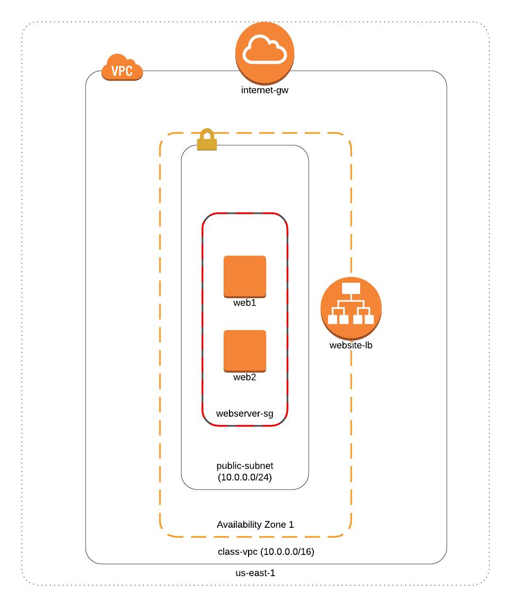

:doctype: article
:blank: pass:[ +]

:sectnums!:

= SEIS 665 Week 9 Project: CloudFormation
Jason Baker <bake2352@stthomas.edu>
1.0, 3/20/2018

== Overview
Create a basic webserver failover architecture in AWS using a CloudFormation template.

== Requirements

  * AWS account.
  * SSH terminal application.
  * Code editor

== The project

Let's get started!

=== Create a CloudFormation template.

In this week's class project, you will create a CloudFormation template to build a basic stack which includes an 
application load balancer and two webservers. Modifying template code requires a code editor. Here is a list of 
some popular free editors:

  * Atom (https://atom.io/)
  * Visual Studio Code (https://code.visualstudio.com/)
  * Notepad++ (https://notepad-plus-plus.org/)

You can review the class powerpoint presentation, AWS CloudFormation documentation, and YouTube resources if you
need help to figure out how to configure a resource. The AWS CloudFormation Resources documentation is particularly
helpful:

    https://docs.aws.amazon.com/AWSCloudFormation/latest/UserGuide/aws-template-resource-type-ref.html

You may use the template below as a starting point for the project. 

    https://s3.amazonaws.com/seis665/BasicVPC.json

The template will create a stack containing a basic VPC environment:

    * VPC
    * Internet Gateway
    * Public subnet
    * Routing table with an Internet route
    * Webserver security group
    * Two input parameters (KeyName and YourIp)

You will need to add two t2.micro webservers named *web1* and *web2* to this template. The webservers should use the
*ami-3ea13f29* AMI and be associated with the *webserverSG* security group. 

You will also need to add an application load balancer called *websiteLB* and a target group called *webservers*.

The first step is to figure out which resources you need to add to the template. Create a list of AWS resources you need to
add and review the CloudFormation documentation to understand the associated resource types. Each resource has a set of 
properties which must be set. You can try to launch your template using the CloudFormation dashboard once you have added the 
resources and associated properties to your template file.

Oftentimes you will find that working with infrastructure templates is a trial-and-error process. It's unlikely that you
will succeed on your first attempt when launching a newly built template. Review the CloudFormation events carefully to 
determine what is causing a template to fail, and then make the necessary code changes to fix the issue. 

=== Taskus extraordinarius (optional)

Add the following:

    * An input parameter which allows a user to specify the webserver instance type.
    * An input parameter called *ExpandServers* which allows the user to optionally (yes/no) create a third webserver instance.

=== Show me your work

Please show me your template code.

=== Terminate AWS resources

Remember to terminate all the resources created in this project, including the stack created by your
template.